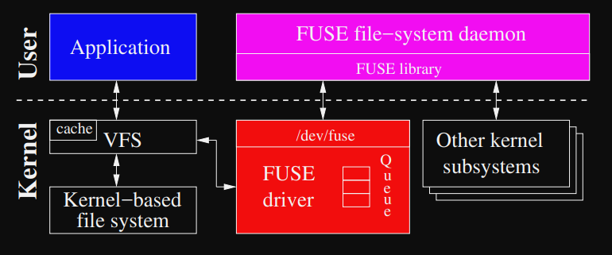
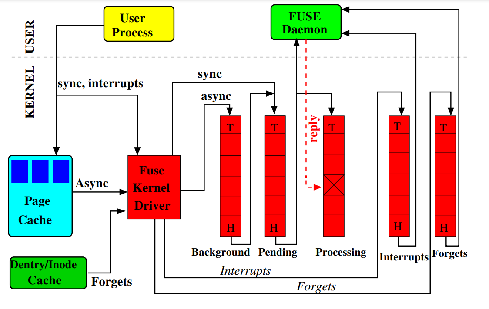

## fuse 内部结构

> [http://libfuse.github.io/doxygen/fast17-vangoor.pdf](http://libfuse.github.io/doxygen/fast17-vangoor.pdf)

> 从现在开始“fuse内核模块”等价于“fuse驱动”

如上图所示，fuse由两部分组成：fuse内核模块和用户空间后台进程。fuse的驱动扮演着代理人的角色，文件系统功能的具体实现则由不同的用户空间后台进程负责。fuse内核模块会注册一个 `/dev/fuse` 块设备，这个设备为用户空间后台进程与fuse驱动提供通信。通常，用户空间进程通过 `/dev/fuse` 读取FUSE请求，当请求处理后有通过`/dev/fuse`写回到fuse驱动。

当用户空间程序在已挂载的fuse文件系统上执行具体操作时，操作系统的VFS层会将此操作路由到FUSE内核驱动。FUSE驱动会分配一个FUSE请求结构体，并把它放入FUSE队列中。此时在fuse文件系统中执行操作的进程通常（同步模式）会被设置为等待模式。FUSE用户空间守护进程会通过读取`/dev/fuse`块设备从驱动中获得此请求并且进行处理。当请求处理完之后再将结果通过`/dev/fuse`写回到fuse驱动；FUSE驱动设置请求状态为“完成”并将fuse文件系统中执行操作的那个进程唤醒。

> 注意：当fuse文件系统读取的文件内容被内核缓存时候，不需要fuse驱动与用户空间fuse文件系统的实现进程进行通信。

### 实现细节

接下来我们讨论几个FUSE重要的实现细节：
- 用户空间与内核空间通信协议
- 用户空间库与API级别
- 内核空间FUSE队列、多线程和回写缓存

#### 用户空间与内核通信协议

当FUSE内核驱动与用户空间后台通信时候，FUSE会形成一个FUSE请求结构体。

请求不同类型取决于它传达的操作，下图列出了FUSE请求的类型（按语义分组）。大部分请求直接映射到VFS操作（比如：READ、CREATE）。

|分类|请求|
|:---|:---|
|Special| INIT, DESTROY, INTERRUPT |
|Metadata| LOOKUP, FORGET, BATCH_FORGET, CREATE, UNLINK, LINK, RENAME, RENAME2, OPEN, RELEASE, STATFS, FSYNC, FLUSH, ACCESS |
|Data| READ, WRITE |
|Attributes| GETATTR, SETATTR |
|Extended Attributes| SETXATTR, GETXATTR, LISTXATTR, REMOVEXATTR |
|Symlinks| SYMLINK, READLINK |
|Directory| MKDIR, RMDIR, OPENDIR, RELEASEDIR, READDIR, READDIRPLUS, FSYNCDIR |
|Locking| GETLK, SETLK, SETLKW |
|Misc| BMAP, FALLOCATE, MKNOD, IOCTL, POLL, NOTIFY_REPLY |

##### INIT

当有fuse文件系统执行挂载操作时候，fuse驱动会产生INIT请求。此时，fuse用户空间进程和fuse驱动将协定使用的协议版本，确定支持哪些能力，以及进行初始参数设置。

##### DESTROY

当卸载fuse文件系统时候，fuse驱动将发送 DESTROY 请求，此时fuse DAEMON需要执行所有的清除操作。此后不会再收到请求，因此 fuse daemon 应该正常退出。

##### INTERRUPT

当前一个请求不再被需要，则由内核发送此请求。

每个请求都有一个 id 号，INTERRUPT 使用此 id 号识别要中断哪个请求。

##### OPEN

用户在 fuse 文件系统中执行打开文件的操作时候会生成 OPEN 请求。

当fuse DAEMON 回复此请求时候，它会为打开的文件分配一个 64 位的文件句柄。这个文件句柄然后由内核连同与打开的文件相关联的每个请求一起返回。

fuse DAEMON 可以使用句柄来存储每打开的文件信息。

##### FLUSH

每个打开的文件被关闭时候会fuse驱动会发送 FLUSH 请求。

##### RELEASE

当对打开的文件不再引用则fuse驱动会发送 RELEASE 请求。

##### OPENDIR

同 OPEN，只是用于文件夹

##### RELEASEDIR

同 RELEASE，只是用于文件夹

##### READDIR

返回一个或多个文件夹入口

##### READDIRPLUS

同 READDIR，但是包含了每个文件夹入口元信息(metadata)

##### ACCESS

当内核评估用户进程是否有权限访问文件时候会产生 ACCESS 请求。

通过处理此请求，fuse daemon 可以实现自定义的权限逻辑。通常来说，用户使用 `default_permissions` 挂载FUSE的时候允许内核基于标准Unix属性来实现允许或拒绝文件访问逻辑，在这种情况下则不会产生 ACCESS 请求。

#### fuse库和API级别

从概念上来讲，fuse库包含两个级别：
- 低级别API：专注于接收和解析来自内核的请求并处理，然后给内核返回相应格式的请求，以此来配置和挂载文件系统
- 高级别API：构建在低级别API之上，允许开发者跳过了 `path-to-inode` 映射。因此，在高级别API中既没有lookup操作也没有inodes操作，简化代码开发。

#### fuse 的5个队列

fuse 使用了5个队列(Queue)，分别如下：
- interrupts：用来放置 INTERRUPT 请求
- forgets：用来放置 FORGET 请求
- pending：用来放置 synchronous 请求（同步请求）
- processing：用来放置正在处理的请求
- background：用于放置异步请求

每个请求在同一时间只能保存在五个队列中的其中一个内。

当fuse 从 `/dev/fuse` 读取请求后，请求被按照如下过程转发到 fuse daemon：
1. 优先处理 INTERRUPT 队列中的请求，此类请求将优先其它
2. FORGET 请求和 non-FORGET 请求公平的读取，每转发 8 个 non-FORGET 请求就会转发 16 个FORGET请求。减少了 FORGET 请求的突发性，同时允许其它请求继续。挂起队列中最早的请求被转到用户空间并将此请求移到 processing 队列中。此时处理队列请求当前由守护进程处理。如果挂起队列为空，则FUSE守护进程在读取调用时候阻塞。当守护进程响应请求（通过写入 /dev/fuse 时），相应的请求将从处理队列中删除。

通用设置中，只有读请求会被放置到 background 队列中；写请求也有可能被放置到 background 队列中，但是仅限回写缓存开启状态，在这种配置中，来自用户进程的写操作首先积累在页缓存中，然后唤醒 bdflush 线程来刷新脏页。当刷新脏页时候，FUSE形成异步写请求并将其放入 background 队列中。

来自 background 队列的请求处理结束后会进入 pending 队列。FUSE 将同时驻留在 pending 队列中的异步请求数量默认限制为 12 个（也可以通过 `max_background` 参数修改）。当 pending 队列中请求数量少于 12 个，则来自 background 队列的请求直接移到 pending 队列，这样做的目的是限制后台请求对重要同步请求造成延迟。

队列的长度没有明确限制，但是，当挂起队列和处理队列中的异步请求数量达到可调与之参数的值（最大后台的75%，默认9个）时候，FUSE会通知 Linux 的 VFS 它已经拥塞；然后VFS会对写入该文件系统的用户进程进行限制写入。

#### 拼接和FUSE缓存

在基础设置中，FUSE daemon必须从 `/dev/fuse` 中进行读请求，以及回写请求处理结果。这样的调用都需要在内核和用户空间之间进行内存拷贝。这会产生大量的读写请求，并且读写请求需要处理大量的数据，为了缓解这个问题，FUSE可以使用Linux内核提供的拼接功能。拼接允许用户空间在两个内核内存缓冲区之间传输数据，而无需将数据复制到用户空间。这可以将数据直接传递给底层文件系统。

为了无缝支持拼接，FUSE以两种形式之一表示其缓存区：
1. 由用户守护进程地址空间中的指针标识的常规内存区域
2. 由文件描述符指向的内核空间内存。

如果用户空间文件系统实现了 `write_buf()` 方法，那么FUSE将从`/dev/fuse`中截取数据，并以包含文件描述符的缓存区的形式将数据直接传递给该方法。FUSE 拼接包含多页数据的 `WRITE` 请求，类似的逻辑页适用于对包含两页以上数据的 READ 请求的响应。

#### 多线程

FUSE 多线程模式下，fuse daemon 初始只有一个线程，如果有两个或多个请求处于 pending 队列，FUSE自动启动多线程。每个线程在同一时间处理一个请求，当请求处理结束后，每个线程都会检查当前运行的线程是否超过10个，如果是则当前线程退出。

#### 回写缓存和最大回写数量

FUSE的基本写入行为是同步的，只有 4KB 的数据被发送到用户守护进程进行写入。这将导致性能问题；在将大文件复制到 FUSE 文件系统时候，`/bin/cp` 会间接的将每4KB数据同步发送到用户空间。

FUSE实现的解决方案是使FUSE的页面缓存支持回写策略，然后使写操作异步化。通过这个更改，文件数据可以以`max_write`大小写入fuse daemon（最大限制为32页）
