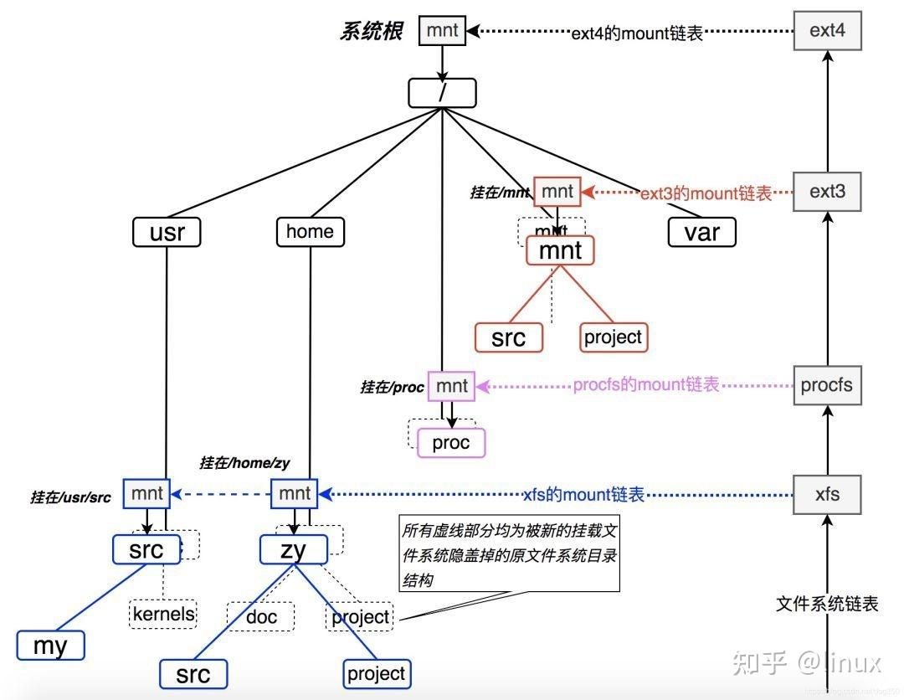
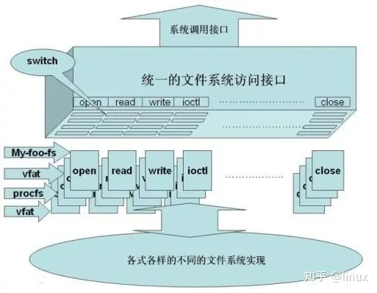
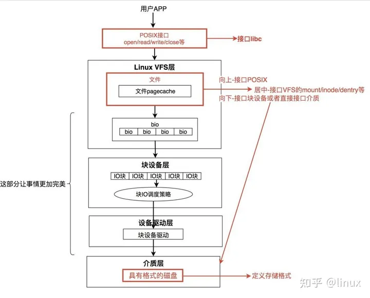

# Linux文件系统

## 文件系统

在Linux内核中，文件系统的树其实它长下面的样子(其实在大多数类UNIX系统中，它们长得都差不多)：

我们看到，Linux系统的文件目录树就是靠上图中的这一系列的链表穿针引线给串在一起的，就像缝制一件衣服一样，最终的成衣就是我们看到的Linux系统目录树，而缝制这件成衣的线以及指导走线的规则便是VFS本身了。

## 两个重要链表

- 文件系统链表
- 每一个文件系统的mount挂载点链表

VFS之所有可以将机制大相径庭的完全不同的文件系统对外统一成一个样子，完全就是依靠了它的统一的对POSIX文件调用的接口，该接口的结构看上去是下面的样子：

注意上图最下面的那个椭圆，如果要实现一个文件系统，这个椭圆里的东西是关键。

现在让我们纵向地看一下一个完整的文件系统实现都包括什么，我指的是从POSIX系统调用开始，一直到数据落盘。Linux内核关于文件系统IO，完整的视图如下所示：

注意VFS提供的三类接口：

- **和POSIX系统调用的接口** 即实现open/read/write的操作的接口。
- **和底层介质的接口** 即下接块设备层的接口。
- **如何管理自身** 即何时以及如何操作VFS数据结构inode，dentry，mount等对象。

一个文件系统如果能实现上面三类接口，那它就是个完整的文件系统了。

我们恰好可以从设计并实现一个最基本的这样的文件系统开始。一个基本的文件系统，其着重点在于上图中红色的部分，而其它部分则不是必不可少的，但是却是让该文件系统变得优秀(而不仅仅是可用)所必须的。
