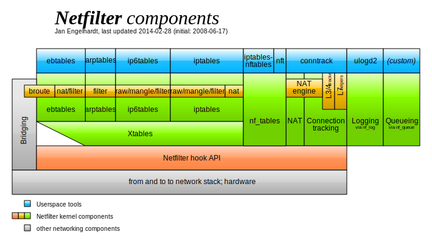

# iptables

提到 iptables，不得不提一下 Netfilter 以确保所学知识的完整。

netfilter 属于 Linux 内核的一部分，它允许内核模块在 Linux 网络堆栈的不同位置注册回调函数。然后，对于穿过Linux网络堆栈中相应Hook的每个数据包，都会调用已注册的回调函数。

netfilter 实现了数据包过滤、网络地址和端口转换(NA[P]T)、数据包日志记录、用户空间数据包排队和其它数据包篡改。

netfilter 项目支持 Linux 内核版本为：`>= Linux 2.4.x`

应用层提供的程序本质就是使用netfilter上述功能，具体有：
- iptables
- nftables
- firewalld
- ufw
- ...（其它）

下图显示了这些工具适用于哪部分功能



下图显示了网络数据包通过Netfilter的过程


## iptables 简介

iptables 是Linux防火墙系统的重要组成部分，iptables的主要功能是实现对网络数据包进出设备及转发的控制。当数据包需要进入设备、流出设备、经设备转发、路由时，都可以用iptables控制。

iptables 默认维护着 4 个表 和 5 个链，所有防火墙策略规则都被写入这些表与链中。

四表指iptables的功能：
- filter表（过滤规则表）：控制数据表是否允许进出及转发，具体控制：INPUT、FORWARD、OUTPUT
- nat表（地址转换规则表）：控制数据包中地址转换，具体控制：PREROUTING、INPUT、OUTPUT、POSTROUTING
- mangle（修改数据标记位规则表）：修改数据包中的原数据，具体控制：PREROUTING、INPUT、OUTPUT、FORWARD、POSTROUTING
- raw（跟踪数据表规则表）：控制nat表中连接追踪机制的启用状况，具体控制：PREROUTING、OUTPUT

五链指内核中控制网络的Netfilter定义的5个规则链。每个规则链表中包含多个数据链：
- INPUT：进入数据过滤
- OUTPUT：输出数据过滤
- FORWARD：转发数据过滤
- PREROUTING：路由前数据过滤
- POSTROUTING：路由后数据过滤

防火墙规则需要写入到这些具体的数据链中。


## iptables 语法格式

```
iptables [-t table] COMMAND [chain] CRETIRIA -j ACTION
```

- `-t`：指定需要维护的防火墙规则表（filter、nat、mangle、raw）；不指定默认使用 filter 表。
- `COMMAND`：子命令，管理规则
    - `-A` 添加防火墙规则
    - `-D` 删除防火墙规则
    - `-I` 插入防火墙规则
    - `-F` 清空防火墙规则
    - `-L` 列出添加的防火墙规则
    - `-R` 替换防火墙规则
    - `-Z` 清空防火墙数据表统计信息
    - `-P` 设置链默认规则
- `chain`：指明链表（INPUT、OUTPUT、FORWARD、PREROUTING、POSTROUTING）

iptables命令常用匹配参数及各自的功能：

|参数|功能|
|:----|:----|
|`[!]-p`|匹配协议，`!` 表示取反|
|`[!]-s`|匹配源地址|
|`[!]-d`|匹配目标地址|
|`[!]-i`|匹配入站网卡接口|
|`[!]-o`|匹配出站网卡接口|
|`[!]--sport`|匹配源端口|
|`[!]--dport`|匹配目标端口|
|`[!]--src-range`|匹配源地址范围|
|`[!]--dst-range`|匹配目标地址范围|
|`[!]--limit`|匹配数据表速率|
|`[!]--mac-source`|匹配源MAC地址|
|`[!]--sports`|匹配源端口|
|`[!]--dports`|匹配目标端口|
|`[!]--state`|匹配状态(`INVALID`、`ESTABLISHED`、`NEW`、`RELATED`)|
|`[!]--string`|匹配应用层字符串|

iptables命令触发动作及各自功能：

|触发动作|功能|
|:---|:---|
|`ACCEPT`|允许数据包通过|
|`DROP`|丢弃数据包|
|`REJECT`|拒绝数据包通过|
|`LOG`|将数据包信息记录syslog日志|
|`DNAT`|目标地址转换|
|`SNAT`|源地址转换|
|`MASQUERADE`|地址欺骗|
|`REDIRECT`|重定向|

内核会按照顺序依次检查 iptables 防火墙规则，如果发现有匹配的规则目录，则立即执行相关动作，停止继续向下查找规则目录；如果所有防火墙规则都未能匹配成功，则按照默认策略处理。使用`-A`选项添加防火墙规则会将该规则追加到整个链的最后，而使用`-I`选项添加的防火墙规则则会默认插入到链中作为第一条规则。

> 地址欺骗：是指对网络通信中的源地址或目标地址进行伪造或欺骗，以隐藏真实身份或欺骗目标系统。当发起网络通信时，通常会使用源IP地址来识别通信的发送方，以及目的IP地址来识别通信的接收方。地址欺骗则是通过伪造这些IP地址中的一个或多个，以达到欺骗的目的。

## iptables 例子

**查看规则**

```
iptables -nvL [filter]
iptables -nvL nat
iptables -nvL raw
iptables -nvL mangle
```

- `-n` 表示不对IP进行反查
- `-v` 表示输出详细信息，包含通过该规则的数据包数量、总字节数、相应的网络接口
- `-L` 表示查看当前表的所有规则，默认查看的是 filter 表

**添加规则**

```
# 注意：默认操作的是 filter 表
iptables -A INPUT -s 192.168.1.1 -j DROP
```

添加规则有两种方法：`-A` 和 `-I`；`-A` 添加一条规则到尾部，`-I` 可以插入到指定位置，没有指定位置就表示插入规则首部。

**修改规则**

```
# 把 第6行 的规则 修改为如下：
iptables -R INPUT 6 -s 192.168.1.1 -j ACCEPT
```

修改规则使用 `-R`

**删除规则**

```
iptables -D INPUT 6
# 或者 把具体项输全
```

## iptables 规则备份

使用 iptables-save

语法如下：

```
iptables-save [-M modprobe] [-c] [-t table] [-f filename]
```

保存所有规则使用：

```
iptables-save > /保存/路径
```

## iptable 规则还原

使用 iptables-restore

语法如下：

```
iptables-restore [-chntvV] [-w seconds] [-M modprobe] [-T name] [file]
```

还原保存的所有规则使用：

```
iptables-restore < /保存/路径
```

## 参考网站

[https://www.netfilter.org/index.html](https://www.netfilter.org/index.html)

[https://wiki.dreamrunner.org/public_html/Linux/Networks/netfilter.html](https://wiki.dreamrunner.org/public_html/Linux/Networks/netfilter.html)
