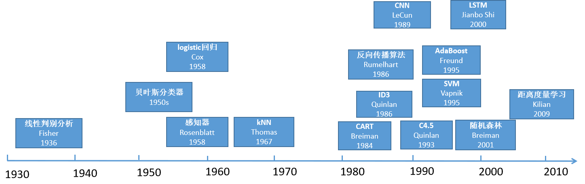
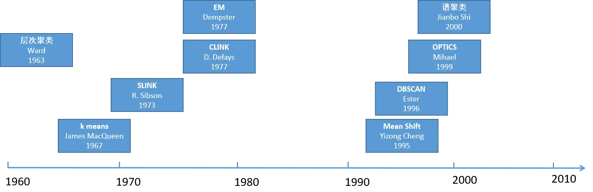

## 机器学习历史

最早的机器学习算法可以追溯到20世纪初，到今天为止，已经过去了100多年。在这100多年中，经过一代又一代人的努力，诞生出了大量经典的方法，在本文中，将机器学习分为有监督学习，无监督学习，深度学习，强化学习4个大方向对历史上出现的经典算法进行整理与总结，帮助大家理清机器学习这100多年来的发展历史，完成对机器学习的寻根问祖之旅。

### 算法分类

总体上，机器学习算法可以分为有监督学习，无监督学习，强化学习3种类型。半监督学习可以认为是有监督学习与无监督学习的结合，不在本文讨论的范围之类。

#### 有监督学习

有监督学习通过训练样本学习得到一个模型，然后用这个模型进行推理。例如，我们如果要识别各种水果的图像，则需要用人工标注（即标好了每张图像所属的类别，如苹果，梨，香蕉）的样本进行训练，得到一个模型，接下来，就可以用这个模型对未知类型的水果进行判断，这称为预测。

如果只是预测一个类别值，则称为分类问题；如果要预测出一个实数，则称为回归问题。

**有监督学习预测结果两大类：分类 和 回归**

#### 无监督学习

无监督学习则没有训练过程，给定一些样本数据，让机器学习算法直接对这些数据进行分析，得到数据的某些知识。

其典型代表是聚类，例如，我们抓取了1万个网页，要完成对这些网页的归类，在这里，我们并没有事先定义好的类别，也没有已经训练好的分类模型。聚类算法要自己完成对这1万个网页的归类，保证同一类网页是同一个主题的，不同类型的网页是不一样的。无监督学习的另外一类典型算法是数据降维，它将一个高维向量变换到低维空间中，并且要保持数据的一些内在信息和结构。

**无监督学习结果两大方向：聚类 和 数据降维**

#### 强化学习

强化学习是一类特殊的机器学习算法，算法要根据当前的环境状态确定一个动作来执行，然后进入下一个状态，如此反复，目标是让得到的收益最大化。

如围棋游戏就是典型的强化学习问题，在每个时刻，要根据当前的棋局决定在什么地方落棋，然后进行下一个状态，反复的放置棋子，直到赢得或者输掉比赛。这里的目标是尽可能的赢得比赛，以获得最大化的奖励。

### 有监督学习

#### 线性判别分析（LDA）

线性判别分析（LDA）是Fisher发明的，其历史可以追溯到1936年，那时候还没有机器学习的概念。这是一种有监督的数据降维算法，它通过线性变换将向量投影到低维空间中，保证投影后同一种类型的样本差异很小，不同类的样本尽量不同。

#### 贝叶斯分类器

贝叶斯分类器起步于1950年代，基于贝叶斯决策理论，它把样本分到后验概率最大的那个类。

**条件概率**

#### 逻辑回归

logistic回归的历史同样悠久，可以追溯到1958年。它直接预测出一个样本属于正样本的概率，在广告点击率预估、疾病诊断等问题上得到了应用。

#### 感知器模型

感知器模型是一种线性分类器，可看作是人工神经网络的前身，诞生于1958年，但它过于简单，甚至不能解决异或问题，因此不具有实用价值，更多的起到了思想启蒙的作用，为后面的算法奠定了思想上的基础。
#### KNN

kNN算法诞生于1967年，这是一种基于模板匹配思想的算法，虽然简单，但很有效，至今仍在被使用。

> 最临近算法，常用语推荐系统

> 在此之前，机器学习算法是零碎化的，后续才开始形成独立方向并快速发展。

#### 决策树

**决策树用于解决 分类 和 回归 问题**

决策树三种实现：ID3、CART、C4.5。

##### ID3

ID3(Iterative Dichotomiser 3)，基于信息论的概念，通过选择对目标变量具有最大信息增益的特征来进行决策树的构建。信息增益表示在添加特征后目标变量的不确定性减少的程度，即：特征对于分类的重要性。

ID3算法分类步骤如下：
1. 选择一个目标变量，将数据集分为不同的类别（分类问题）或者计算目标变量的平均值（回归问题）
2. 对于每个特征，计算其对目标变量的信息增益。信息增益可以使用熵或者基尼系数来度量。
3. 选择具有最大信息增益的特征作为当前节点的划分标准。
4. 根据选择的特征，将数据集划分为多个子集，每个子集对应特征的一个取值。
5. 对于每个子集，递归的应用上述步骤，构建子树。
6. 当满足终止条件时，停止构建树。例如：可以设置树的最大深度、节点的最小样本数。
7. 构建完成后，得到一个分类决策树

##### CART

CART(Classification and Regression Trees) 是一种经典的决策树算法。决策树是一种基于树结构的监督学习方法，用于解决分类和回归问题。

CART算法的基本思想是通过对数据集进行递归的二次切分，构建出一颗二叉树模型。在构建过程中，CART算法通过选择最优的切分特征和切分点，使得每个子节点上的样本尽可能都属于同一类别（分类问题）或者具有相似的输出值（回归问题）

分类问题中，CART决策树使用基尼系数或熵作为切分标准，衡量节点的纯度。

回归问题中，CART决策树使用平方误差作为切分标准，衡量节点的拟合程度。

##### C4.5

C4.5是ID3算法的改进版本。它于1993年提出，是一种用于解决分类问题的监督学习方法。

C4.5 核心思想是基于信息增益比来选择最优的切分特征。信息增益是衡量特征对于分类任务的重要性指标，它表示通过特征划分后，对于减少样本的不确定性所带来的信息量。信息增益比则是将信息增益除以特征的固有信息，固有信息表示特征本身的不确定性。

C4.5与ID3比，在以下几个方面进行了改进：
1. 处理缺失值：C4.5可以处理缺失值，通过对缺失值进行处理，保证来算法的鲁棒性
2. 连续特征处理：C4.5算法可以处理连续特征，通过将连续特征离散化为几个离散的取值，使得决策树能够处理连续性数据。
3. 剪枝策略：C4.5算法引入了剪枝策略，通过对决策树进行剪枝，避免了过拟合的问题。

C4.5算法在实际应用中具有较好的性能，但也存在一些限制。例如：他对高维数据和数据中的噪声比较敏感。此外，C4.5产生的决策树可能产生较深的树结构，导致模型复杂度较高，解释性较差。

#### 反向传播算法

反向传播算法是一种用于训练人工神经网络的常用方法。它通过使用梯度下降优化算法，逐层计算误差梯度并将其传递回网络的前一层，从而更新网络的权重和偏置。

以下是反向传播算法的基本步骤：
1. 正向传播：将输入样本通过神经网络的前向传播，逐层计算每一个神经元的输出值。从输入层开始，通过每一层的权重和激活函数，将信息传递到输出层。
2. 计算误差：将神经网络的输出值与样本的真实标签进行比较，计算输出层的误差。误差通常使用某种损失函数（比如：均方误差）来度量。
3. 反向传播：从输出层开始，逆向计算每个神经元的梯度。利用链式法则，将输出层的误差梯度传递回前一层，并逐层计算每个神经元的梯度。
4. 权重更新：利用计算得到的梯度信息，使用梯度下降优化算法（如：随机梯度下降）来更新每个神经元的权重和偏置。更新的步骤是根据梯度和学习率来调整权重和偏置的值，以最小化损失函数。
5. 重复迭代：重复执行步骤1到步骤4，直到达到预先定义的停止条件（如达到最大迭代次数或损失函数收敛）。

通过不断迭代和更新权重，反向传播算法可以逐渐调整神经网络参数，使其能够更好的拟合训练数据，并在未见过的数据上进行预测。

#### 卷积神经网络（CNN）

卷积神经网络（Convolutional Neural Network, CNN）是一种广泛应用于计算机视觉和图像处理领域的神经网络算法。它在处理具有网络结构的输入数据（例如：图像）是表现出色，并且能够自动学习和提取输入数据中的空间层次结构特征。

CNN算法的核心是卷积层（Convolutional Layer），它通过应用一系列滤波器（也称为卷积和）来提取输入数据中的特征。卷积操作可以有效的捕捉输入数据的局部关系，并且参数共享的机制使得网络具有平移不变性，即：对于图像中相同的特征，无论其出现在图像的哪个位置都能识别出来。

CNN算法通常由以下几个关键组件组成：
1. 卷积层：卷积层通过卷积操作对输入数据进行特征提取。每个卷积层都由多个滤波器组成，每个滤波器与输入数据进行卷积运算，生成特征图。
2. 激活按函数：卷积层后通常会应用一个非线性激活函数，如ReLU，用于引入非线性特性。
3. 池化层：池化层用于减少特征图的空间维度，并减少网络参数。常用的池化操作包括最大池化和平均池化
4. 全连接层：全连接层将前面的卷积层和池化层的输出展平，并连接到一个或多个全连接层，用于进行分类或回归等任务。
5. Dropout层：Dropout层用于防止过拟合，随机的将一部分神经元的输出置为0，从而减少神经元之间的依赖关系。
6. Softmax层：用于多类别分类任务，将网络的输出转化为概率分布。
CNN算法的训练过程通常使用反向传播算法进行权重更新，通过最小化损失函数来优化网络的参数。同时，可以借助数据增强、批量归一化、正则化等技术来进一步提升模型的性能和鲁棒性。

总之，卷积神经网络通过卷积层和池化层的组合，以及其他辅助组件的配合，可以有效的提取图像等网络结构数据中的特征，并在许多计算机视觉中取得优秀的表现。

#### SVM

支持向量机（Support Vector Machine, SVM）是一种监督学习算法，常用于分类和回归问题。它的基本思想是通过找到一个最优的超平面来将不同类别的样本分开。在二维空间中，这个超平面就是一条直线，而在高维空间中就是一个超平面。

SVM 的主要目标是找到一个能够最大化样本问题间间隔的超平面。间隔是指离超平面最近的样本点到超平面的距离，SVM的目标是找到最大的间隔，使得超平面能够最好地将不同类别的样本分开。

SVM 核心概念是支持向量，它们是离超平面最近的样本点。支持向量决定了超平面的位置和方向。SVM的训练过程就是找到这些支持向量以及超平面的位置。

对于线性可分的情况，SVM的目标是找到一个硬间隔的超平面，即要求所有样本能够正确的分开，因此可以引入松弛变量来允许一些样本被分类错误或落在间隔内部。这就是软间隔的概念，它允许在最大化间隔的同时，容忍一定的分类错误。

当数据不是线性可分的时候，可以通过引入核函数将数据映射到高维空间中，使其在高维空间中线性可分。常用的核函数有线性核、多项式核、高斯核等。这样，SVM可以在高维空间中找到一个超平面来进行分类。

SVM 除了用于分类还可以用于回归问题。在回归问题中，SVM的目标是找到一个超平面，使得样本点与超平面的距离尽可能小，并且满足一定的容忍度。这种方法被称为支持向量回归（Support Vector Regression, SVR）。

**SVM是一种强大的机器学习算法，它通过最大化间隔来寻找最优超平面，能够处理线性可分和线性不可分的情况，并且通过核函数可以处理高维空间的数据。它在实际应用中具有广泛的用途，包括分类和回归问题**

#### AdaBoost

AdaBoost的基本思想是，每个弱分类都针对当前样本分布进行训练，然后根据分类结果调整样本权重，使得被错误分类的样本在后续训练中得到更多的关注。这样在多轮迭代中，AdaBoost逐渐聚焦于难以分类的样本，提高整体分类的准确性。

下面是AdaBoost的基本步骤：
1. 初始化样本权重：对于包含N个样本的训练数据基，初始化每个样本的权重为`1/N`。
2. 迭代训练弱分类器：进行T轮迭代（T是预先设定的迭代次数），每轮迭代训练一个弱分类器。在每轮迭代中，根据当前样本权重分布，训练一个弱分类器，该分类器的训练目标是尽可能减少加权分类误差。
3. 更新样本权重：根据当前弱分类器的分类结果，更新每个样本的权重。被正确分类的样本权重降低，被错误分类的样本权重增加，以便下一轮迭代时更关注被错误分类的样本。
4. 弱分类器权重计算：根据每个弱分类器的分类准确性，计算其在最终分类器中的权重。
5. 构建最终分类器：将每个弱分类器与其权重相乘，得到最终的强分类器。

AdaBoost 的优点是能够有效的组合多个弱分类器，提高整体分类性能。它在处理而分类问题时候表现良好，并且对于复杂数据集具有较强的适应能力。此外，AdaBoost在训练过程中对于误分类样本的关注度逐步增加，可以有效应对噪声数据和异常样本。

然而，AdaBoost也有一些限制。它对异常值敏感，可能会对异常样本过拟合。此外，AdaBoost的训练过程是串行的，每轮迭代都依赖前一轮的结果，因此无法并行化处理。

总结来说，AdaBoost是一种集成学习算法，通过迭代训练弱分类器并调整样本权重来提高整体分类性能。它是一种强大的分类算法，在实际应用中被广泛使用。

#### LSTM

LSTM(Long Short-Term Memory) 是一种循环神经网络（Recurrent Neural Network,RNN）的变体，用于处理序列数据和解决时间相关的任务，能够更好的捕捉和记忆长期依赖关系。

在传统 RNN 中，信息的传递依赖于激活函数的循环连接，导致在处理长序列时容易出现梯度消失或梯度爆炸的问题。LSTM通过引入三个门控单元（输入门、遗忘门、输出门），有效的解决了这个问题。

LSTM的基本结构如下：
1. 输入门（Input Gate）：控制是否将输入信息纳入到细胞状态。它根据当前输入和前一时刻的隐藏状态进行计算，输出一个介于0到1之间的数值，表示对应位置的输入的重要性。
2. 遗忘门（Forget Gate）：控制是否将前一时刻的细胞状态纳入到当前时刻的细胞状态中。它根据当前输入和前一时刻的吟唱状态进行计算，输出一个介于0到1之间的数值，表示对应位置的细胞状态的保留程度。
3. 细胞状态（Cell State）：负责记忆长期依赖关系。它由输入门、遗忘门和前一时刻细胞状态共同决定。通过输入门和遗忘门的计算，可以更新细胞状态的内容。
4. 输出门（Output Gate）：控制从细胞状态中提取多少信息输出到下一个时刻的隐藏状态。它根据当前输入和前一时刻的吟唱状态进行计算，输出一个介于0到1之间的数值，表示对应位置的隐藏状态的重要性。

LSTM网络通过堆叠多个LSTM单元来建立深层网络结构，每个LSTM单元的隐藏状态作为下一个LSTM单元的输入。这种结构使得LSTM能够有效的处理长序列数据，并具有较强的记忆能力。

LSTM在自然语言处理(NLP)、语音识别、机器翻译、等任务中取得了显著成果。它嫩够捕捉句子中的语义和上下文信息，并在处理文本序列时候表现优秀，此外，LSTM还可以与其它神经网络结构相结合，例如卷积神经网络和注意力机制，以进一步提高性能。

总结而言，LSTM是一种具有门控机制的循环神经网络，通过输入门、遗忘门、输出门来控制信息的流动和记忆，使其能够有效的处理长序列数据和捕捉长期依赖关系。它在序列数据处理和时间相关任务中表现出色，并在多个领域取得了重要的作用。

#### 随机森林

随机森林是一种集成学习算法，用于解决分类和回归问题。它由多个决策树组成，每个决策树都是独立训练的。随机森林的主要思想是通过合并多个弱学习器（决策树）的预测结果来得到更准确的预测。

下面是随机森林算法的主要步骤：
1. 数据准备：随机森林算法需要一个带有标签的训练数据集作为输入。每个数据点都包含一组特征和一个对应的特征。
2. 随机选择特征：对于每棵决策树的训练，从所有特征中随机选择一部分特征。这样可以确保每个决策树使用的特征都是不同的。
3. 构建决策树：使用选定的特征和训练数据集，构建一颗决策树。构建过程中可以使用不同的决策树算法。如：CART（分类和回归树）算法。
4. 重复2和3：重复选择特征和构建决策树的过程，直到生成指定数量的决策树。
5. 预测：对于分类问题，随机森林通过投票或多数表决的方式，将每棵决策树的预测结果合并为最终的分类结果。对于回归问题，随机森林通过取平均值的方式，将每棵决策树的预测结果合并为最终的回归结果。

随机森林的优点：
- 能够处理高维数据和大规模数据集
- 它在处理缺失数据时表现良好。
- 随机森林能估计特征的重要性，用于特征选择。
- 它对异常值和噪声相对稳健。

--------
1980年开始，到2012年深度学习兴起之前，有监督学习得到了迅速发展，这期间出现的算法层出不穷、但无一具有压倒性优势。

### 无监督学习

#### 聚类

聚类算法的历史与有监督学习一样悠久。层次聚类算法出现于1963年，这是非常符合人的直观思维的算法，现在还在使用。它的一些实现方式，包括SLINK，CLINK则诞生于1970年代。

##### SLINK

SLINK(Single-Link Clustering)是一种基于距离的聚类算法，用于将数据点分组成不相交的聚类集合。

SLINK算法的核心思想是通过最小距离来度量聚类之间的相似性。

下面是SLINK聚类算法的主要步骤：
1. 初始化：将每个数据点视为一个独立的聚类。
2. 计算距离矩阵：计算每对数据点之间的距离，并构建一个距离矩阵。距离可以使用不同的度量方式，如：欧式距离或曼哈顿距离。
3. 合并聚类：按照最小距离的原则，逐步合并距离最近的两个聚类。具体而言，从距离矩阵中找到最小距离的两个聚类，将它们合并成一个新的聚类。
4. 更新距离矩阵：在合并聚类后，需要更新距离矩阵。合并后的聚类与其它聚类之间的距离可以通过不同的方式来计算，最常用的是采用单连接（Single-linkage）的方式，即使用两个聚类中距离最近的数据点之间的距离来表示聚类之间的距离。
5. 重复步骤3和4：重复合并聚类和更新距离矩阵的过程，直到所有数据点都被合并到一个聚类中，或者达到预先设定的聚类数量。

SLINK算法的优点是简单且易于实现，适用于处理大规模数据集。然而，它也有一些限制，例如：对噪声和异常值比较敏感，可能会导致错误的聚类结果。此外，SLINK算法倾向于形成长而薄的聚类，这可能不是用于所有数据集。

##### CLINK

##### EM算法

EM（Expectation-Maximization）聚类算法是一种基于概率模型的聚类算法，用于将数据点分组成不相交的聚类。它是一种迭代算法，通过交替进行“期望”和“最大化”两个步骤来优化聚类结果。

下面是EM聚类算法的主要步骤：
1. 初始化：选择聚类的数量和初始参数。这些参数可以是聚类中心的座标、聚类的权重、协方差矩阵等。
2. Expectation步骤：计算每个数据点属于每个聚类的概率，即后验概率。使用当前的参数估计值，通过贝叶斯公式计算每个数据点属于每个聚类的概率。
3. Maximization步骤：基于Expectation步骤的结果，更新参数估计值以最大化似然函数。通过最大化似然函数，调整聚类的参数，如聚类中心的位置、权重、协方差矩阵等。
4. 重复步骤2和3:迭代执行Expectation和Maximization步骤，直到算法收敛或达到预定的迭代次数。
5. 输出结果：最终的聚类结果可以通过最后一次迭代的参数估计值得到，每个数据点被分配到最有可能的聚类中。

EM聚类算法的有点事能够处理混合高斯模型等概率模型，并且对于缺失数据和噪声相对鲁棒。它在密度估计和软聚类（每个数据点都具有一定的属于每个聚类的概率）方面具有优势。

然而EM聚类算法也有一些限制。首先它对初始参数的选择敏感，不同的初始参数可能导致不同的聚类结果。其次，EM算法可能收敛到局部最优解而不是全局最优解。因此，多次运行算法并选择最好的结果是一种常见的策略。

总体而言，EM聚类算法是一种基于概率模型的迭代算法，用于聚类分析。它在许多实际应用中被广泛使用，尤其在混合模型的聚类和密度估计问题上表现出色。

##### Mean Shift算法

Mean Shift算法是一种基于密度的非参数化聚类方法，用于识别数据中的聚类结构。它通过迭代过程来寻找数据点密度最大的区域，从而确定聚类中心。

下面是 Mean Shift聚类算法的主要步骤：
1. 初始化：为每个数据点选择一个初始位置作为聚类中心。
2. Kernel函数：定义一个核函数，用于计算数据点之间的相似度。常用的核函数包括高斯核函数和均匀核函数。
3. Mean Shift过程：对于每个聚类中心，计算数据点在其周围的密度加权平均值，以确定下一个迭代步骤中的心聚类中心。这个过程可以使用核函数来计算领域内的权重。
4. 更新聚类中心：将每个聚类中心更新为上一步中计算得到的新聚类中心。
5. 重复步骤3和4:迭代执行Mean Shift过程，直到聚类中心不再发生显著移动，或者达到预定的迭代次数。
6. 输出结果：最终的聚类结果是每个数据点所属的聚类中心。

Mean Shift聚类算法的核心思想是将数据点移动到密度最大的区域，从而找到聚类中心。它不需要实现指定聚类的数量，而是根据数据的分布自动确定聚类的数量和形状。由于它是一种非参数化方法，可以适应各种数据分布。

然而，Mean Shift 聚类算法也有一些限制。它对于初始化聚类中心的选择敏感，不同的初始位置可能导致不同的聚类结果。其次，算法的计算复杂度较高，特别是在处理大规模数据集的时候可能会面临挑战。

总体而言，Mean Shift聚类算法是一种基于密度的非参数化聚类方法，通过迭代过程来寻找数据中的聚类结构。它在某些情况下可以产生有用的聚类结果，并且不需要预先指定聚类的数量。

##### 谱聚类算法

谱聚类（Spectral Clustering）算法是一种基于图论的聚类算法，它通过将数据几种的样本转化为图的形式，然后在图上进行聚类操作。谱聚类算法的核心思想是利用样本之间的相似性构建图表示，并通过图的特征值分解来获取聚类结果。

下面是谱聚类算法的基本步骤：
1. 构建相似度图：对于给定的数据集，首先需要计算任意两个样本之间的相似度。常用的相似度度量包括：欧式距离、高斯核函数等。根据相似度计算结果，构建一个相似度图，图中的节点表示样本，边表示样本之间的相似度关系。
2. 图的拉普拉斯矩阵：根据相似度图，构建图的拉普拉斯矩阵。拉普拉斯矩阵有多种形式，常见的是对称归一化拉普拉斯矩阵。该矩阵可以用来度量图的结构特性。
3. 特征值分解：对图的拉普拉斯矩阵进行特征值分解，得到特征值和对应的特征向量。通常情况下，只需要计算特征值较小的几个。
4. 特征向量聚类：将特征向量按照特征值的大小进行排序，选取前几个特征向量作为新的样本表示。然后使用传统的聚类算法（如:K-means）对新的样本进行聚类操作。

谱聚类算法的优点是能够处理非凸相撞的聚类问题，对于复杂的数据结构有良好的表现。它不依赖于数据的分布假设，并且可以处理高维数据。然而，谱聚类算法的计算复杂度较高，特别是在处理大规模数据时候，可能面临较大的计算开销。

#### 数据降维

将高纬度数据映射到低维度空间的过程，目的是减少数据的维度，同时尽可能保留原始数据的关键信息。

数据降维可以带来多种好处：减少存储空间、加快计算速度、去处冗余特征、可视化数据等。

两种数据降维的方法：
1. 主成分分析（Principal Commponent Analysis，简称PCA）：是一种无监督的线性降维方法。它通过找到数据中最重要的方向，即主成分，将数据映射到这些主成分上。主成分是原始特征的线性组合，具有最大的方差。通过保留最重要的K个主成分，可以将数据从高纬度空间降到低维度空间。PCA的过程涉及特征值分解或奇异值分解，通过计算协方差矩阵或数据的奇异值分解来实现。
2. t-SNE（t-Distributed Stochastic Neighbor Embedding）：t-SNE 是一种非线性降维方法，主要用于可视化高纬度数据。它通过在高纬度空间中保持样本之间的相似性，将数据映射到低纬度空间中。t-SNE算法通过优化一个目标函数，使得低纬度空间中的样本对应于高维度空间中的样本之间的相似性更加准确。t-SNE保留局部结构的同时，也能够捕捉全局的数据特征。

#### 深度学习与神经网络

深度学习是机器学习的一个分支，它致力于通过构建和训练多层神经网络来实现对数据进行学习和推断。神经网络是深度学习的核心组成部分，它是一种模拟人脑神经元相互连接的计算模型。

神经网络由多个层次组成，每一层都由许多神经元（或称为节点）组成。每个神经元接收来自上一层神经元的输入，并通过激活函数对输入进行非线性变换，然后将结果传递给下一层神经元。神经元的最后一层通常是一个输出层，用于产生最终的预测结果。

深度学习中的神经网络可以具有多种结构，常见的包括前馈神经网络（Feedforward Neural Networks, FNN）、卷积神经网络（Convolutional Neural Network, CNN）、循环神经网络（Recurrent Neural Networks, RNN）等。

前馈神经网络是最基本的神经网络模型，信息只能从输入层流向输出层，没有反馈连接。它适用于处理分类和回归等任务。

卷积神经网络在计算机视觉领域具有重要低位，主要用于图像和视频数据的处理。它引入了卷积层和池化层，能够有效的提取图像中的特征。

循环神经网络主要用于处理序列数据，如语言模型、文本生成和机器翻译等任务。它具有记忆性，可以传递信息和处理时间序列上的依赖关系。

深度学习的优势在于它能够自动从数据中学习到更抽象和高级的特征表示，无须手动设计特征。通过反向传播算法和梯度下降优化方法，神经网络能够自动调整权重和偏置，以最小化预测结果和真实标签之间的差异。

深度学习和神经网络已经在许多领域取得了显著的成果，包括计算机视觉、自然语言处理、语言识别和推荐系统等。它们在大规模数据和强大计算资源的支持下展现了强大的学习能力，并在许多任务上超越了传统的机器学习方法。

### 强化学习

强化学习（Reinforcement Learning）是一种机器学习的分支，其目的是通过智能体（Agent）与环境的交互学习，使得智能体能够通过试错的方式从环境中获取最大的累积奖励。

在强化学习中，智能体通过观察环境的状态（state）来作出决定，执行相应的动作（Action），然后从环境中接收降级（Reward）。智能体的目标是通过与环境的交互，学习一种策略，使得在特定环境下能够最大化积累奖励。

强化学习的核心思想是采用试错的方式进行学习，智能体通过尝试不同的动作并观察结果，然后根据获得的奖励信号来调整策略。通过不断的与环境进行交互，智能体逐渐学习到最优的策略，以获得最大的奖励。

强化学习中的关键概念包括：
1. 状态（State）：环境的当前观测或描述，它包括了智能体所需的信息
2. 动作（Action）：智能体在给定状态下可以执行的操作或决策。
3. 奖励（Reward）：环境根据智能体的动作给予的反馈信号，用于评估动作的好坏
4. 策略（Policy）：智能体在给定状态下选择动作的策略，它可以是确定性的或概率性的

强化学习算法主要基于价值函数（Value Function）或策略梯度（Policy Gradient）来进行学习和优化。常见的强化学习算法包括：Q-learning、SARSA、深度Q网络（Deep Q-Network，DQN）、策略梯度方法等。
