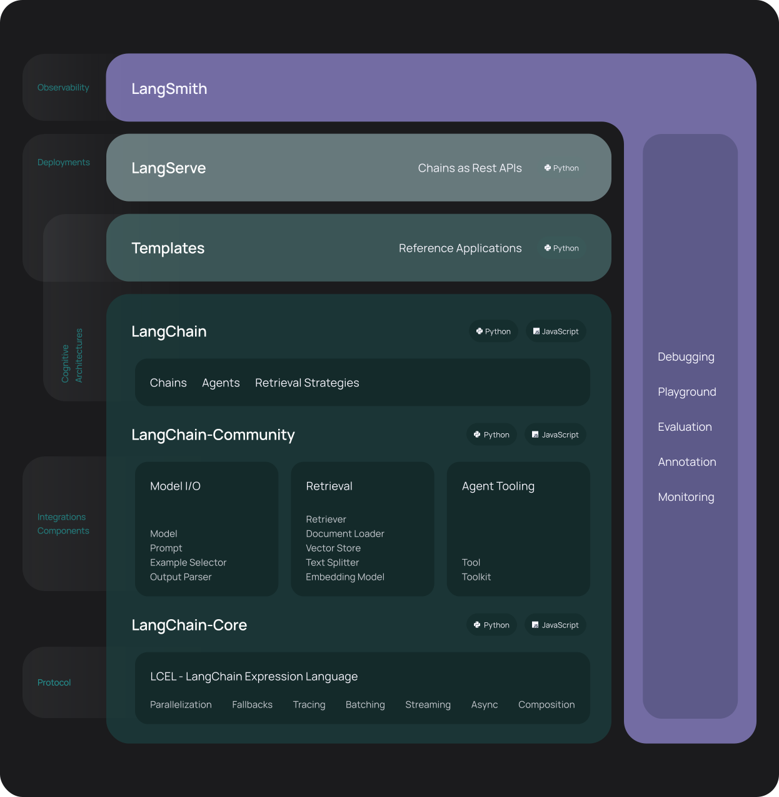

## LangChain快速上手

LangChain是一个用于开发由大型语言模型（LLM）提供支持的应用程序的框架。

LangChain简化了LLM应用程序生命周期的每个阶段：
- 开发：使用LangChain的开源构建块和组件构建您的应用程序。
- 产品化：使用LangSmith来检查、监控和评估您的链，以便您可以不断优化和部署。
- 部署：使用LangServe将任何链转化为API。



具体而言，该框架由以下开源库组成：
- langchain核心：基础抽象和langchain表达式语言。
- langchain社区：第三方集成。
    - 合作伙伴包（例如langchain-openai、langchain-anthropic等）：一些集成已被进一步拆分为自己的轻量级包，这些包仅依赖于langchain-core。
- langchain：构成应用程序认知架构的链、代理和检索策略。
- langgraph：通过将步骤建模为图中的边和节点，使用LLM构建健壮且有状态的多参与者应用程序。
- langserve：将LangChain链部署为RESTAPI。

更广泛的生态系统包括：
- LangSmith：一个开发人员平台，允许您调试、测试、评估和监控LLM应用程序，并与LangChain无缝集成。

### 安装

#### 安装Jupyter Notebook

Jupyter Notebook 作为开发LLM的编辑工具。

#### 安装 LangChain

```shell
pip install langchain
```

或 conda
```shell
conda install langchain -c conda-forge
```

#### 配置LangSmith

使用LangChain构建的许多应用程序将包含多个步骤，其中包含多次LLM调用调用。随着这些应用程序变得越来越复杂，能够检查链或代理内部到底发生了什么变得至关重要。最好的方法是与LangSmith合作。

请注意，LangSmith不是必需的，但它是有帮助的。如果您确实想使用LangSmith，在上面的链接注册后，请确保将环境变量设置为开始记录跟踪：

```
export LANGCHAIN_TRACING_V2="true"
export LANGCHAIN_API_KEY="..."
```

#### 使用LangChain构建

LangChain支持构建将外部数据和计算源连接到LLM的应用程序。在这个快速入门中，我们将介绍几种不同的方法。我们将从一个简单的LLM链开始，它只依赖于提示模板中的信息来响应。接下来，我们将构建一个检索链，它从一个单独的数据库中获取数据，并将其传递到提示模板中。然后，我们将添加聊天历史记录，以创建一个会话检索链。这允许您以聊天的方式与此LLM进行交互，因此它可以记住以前的问题。最后，我们将构建一个代理，它利用LLM来确定是否需要获取数据来回答问题。我们将高水平地报道这些，但所有这些都有很多细节！我们将链接到相关文档。

##### OpenAI

使用 OpenAI 提供的模型API来访问大模型：

导入
```
pip install langchain-openai
```

访问API需要API密钥，您可以通过在此处创建帐户和标题来获得该密钥。一旦我们有了密钥，我们就想通过运行以下命令将其设置为环境变量：

```
export OPENAI_API_KEY="..."

```

初始化模型
```python
from langchain_openai import ChatOpenAI

llm = ChatOpenAI()
```

如果您不希望设置环境变量，则可以在启动OpenAI LLM类时通过api_key命名参数直接传入密钥：

```python
from langchain_openai import ChatOpenAI

llm = ChatOpenAI(api_key="...")
```

一旦您安装并初始化了您选择的LLM，我们就可以尝试使用它！

```python
llm.invoke("how can langsmith help with testing?")
```

我们还可以使用提示模板来指导其响应。提示模板将原始用户输入转换为LLM的更好输入。

```python
from langchain_core.prompts import ChatPromptTemplate
prompt = ChatPromptTemplate.from_messages([
    ("system", "You are world class technical documentation writer."),
    ("user", "{input}")
])
```

我们现在可以将这些组合成一个简单的LLM链：

```python
chain = prompt | llm
```

我们现在可以援引它并提出同样的问题。它仍然不知道答案，但对于技术作家来说，它应该以更恰当的语气回应！

```python
chain.invoke({"input": "how can langsmith help with testing?"})
```

ChatModel的输出（因此也是这个链的输出）是一条消息。然而，使用字符串通常要方便得多。让我们添加一个简单的输出解析器，将聊天消息转换为字符串。

```python
from langchain_core.output_parsers import StrOutputParser

output_parser = StrOutputParser()
```

我们现在可以将其添加到上一个链中：

```python
chain = prompt | llm | output_parser
```

我们现在可以援引它并提出同样的问题。答案现在将是一个字符串（而不是ChatMessage）。

```python
chain.invoke({"input": "how can langsmith help with testing?"})
```

##### 本地Ollama

Ollama允许您在本地运行开源的大型语言模型，如Llama 2。

下载Ollama后拉取大模型：
```shell
ollama pull llama2
```

然后，确保Ollama服务器正在运行。之后，您可以执行以下操作：
```python
from langchain_community.llms import Ollama
llm = Ollama(model="llama2")
```

一旦您安装并初始化了您选择的LLM，我们就可以尝试使用它！让我们问一下LangSmith是什么——这是训练数据中没有的东西，所以它不应该有很好的反应。

```python
llm.invoke("how can langsmith help with testing?")
```

我们还可以使用提示模板来指导其响应。提示模板将原始用户输入转换为LLM的更好输入。

```python
from langchain_core.prompts import ChatPromptTemplate
prompt = ChatPromptTemplate.from_messages([
    ("system", "You are world class technical documentation writer."),
    ("user", "{input}")
])
```

我们现在可以将这些组合成一个简单的LLM链：
```python
chain = prompt | llm
```

我们现在可以援引它并提出同样的问题。它仍然不知道答案，但对于技术作家来说，它应该以更恰当的语气回应！
```python
chain.invoke({"input": "how can langsmith help with testing?"})
```

ChatModel的输出（因此也是这个链的输出）是一条消息。然而，使用字符串通常要方便得多。让我们添加一个简单的输出解析器，将聊天消息转换为字符串。

```python
from langchain_core.output_parsers import StrOutputParser

output_parser = StrOutputParser()
```

我们现在可以将其添加到上一个链中：

```python
chain = prompt | llm | output_parser
```
我们现在可以援引它并提出同样的问题。答案现在将是一个字符串（而不是ChatMessage）。

```python
chain.invoke({"input": "how can langsmith help with testing?"})
```

----------
我们现在已经成功地建立了一个基本的LLM链。我们只谈到了提示、模型和输出解析器的基本知识——要更深入地了解这里提到的一切，请继续阅读。
