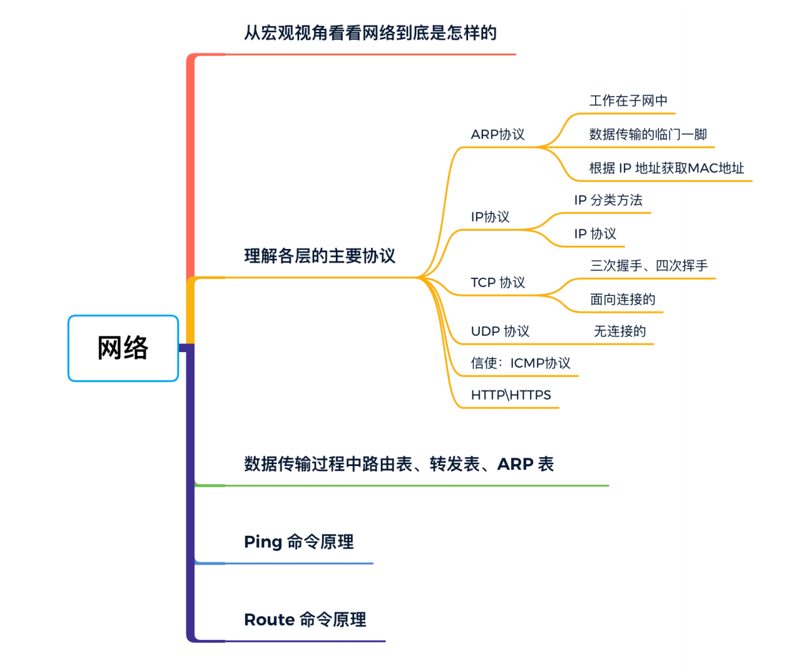

# 网络基础知识点

## 怎么学

- ⾸先要爛宏观视⻆⼤致了解⼀下⽹络到底是怎么样的，重点是⽹络分层模型、传输过程。
- 然后就是理解各个层的主要协议了，主要就是协议的作⽤和协议格式，以及每种协议格⼦的功能特性。
- ⼀个数据包爛发送端到⽬的端要经过纷繁复杂的⽹络结构，经过各种中间设备。爛路由表、转发表和 ARP 表这三张表，可以了解数据包传输的过程。
- 最后是`Ping`、`Route`命令的⼯作原理。

