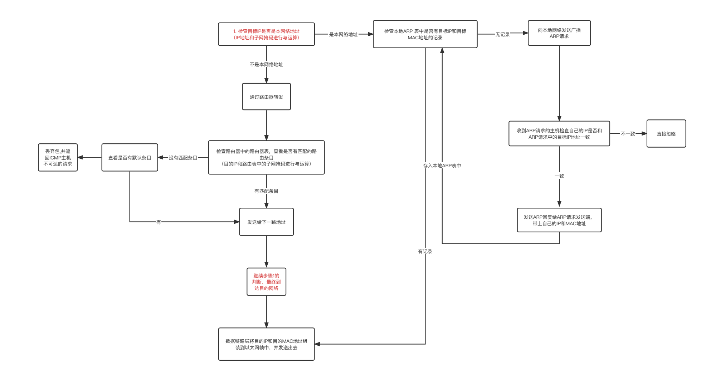

# 网络分层模型

为了让全世界的计算机有效的互联起来，就要制定标准，分层模型就是这种标准的定义，有了这种标准，全世界的软硬件开发者才能开发出通⽤的程序来。

有两种⽹络模型，⼀种是 OSI 7层模型，还有⼀种是 TCP/IP 模型，前者是⼀种概念话的模型；后者是事实上的标准，也就是当今⽹络世界⾥普遍使⽤的模型。

## OSI 7层模型

国际标准化组织提出了⼀种概念化的⽹络模型，开放式系统互联模型（Open System Interconnection Model），简称 OSI 模型。

⾃上⽽下依次为应⽤层、表⽰层、会话层、传输层、⽹络层、数据链路层、物理层。

### 应用层

应⽤层提供为应⽤软件⽽设计的接⼝，以设置与另⼀应⽤软件之间的通信。例如：HTTP、HTTPS、FTP、Telnet、SSH、SMTP、POP3等。

### 表示层

表⽰层把数据转换为能与接收者的系统格式兼容并适合传输的格式。

常见功能：
- 数据格式转换
- 数据加解密
- 数据压缩
- 数据的语法和语义检查

实际使用中常由操作系统（网络协议栈中的TCO和UDP协议来处理）或应用层来（JSON、XML）实现。

### 会话层

负责建立、管理、终止应用程序之间的会话，确保可靠的通信，并提供数据传输的控制和同步

实际使用中常由操作系统或应用程序实现

### 传输层

传输层把传输表头（TH）加⾄数据以形成数据包。传输表头包含了所使⽤的协议等发送信息。例如：传输控制协议（TCP）等。

负责网络中的两个节点之间提供可靠的端到端数据传输。传输的主要功能是分段、传输控制和错误恢复。

下面是传输层的一些主要工作：
- 分段：传输层将应用层提供的数据分割成较小的数据段，以便在网络中传输，这样可以确保数据的有效传输并避免网络传输的过大开销
- 传输控制：传输层提供传输控制协议，例如传输控制协议（TCP），他能确保数据的可靠传输。TCP使用序列号和确认机制来保证数据的有序性、完整性和可靠性。传输层还可以提供无连接的传输协议，例如：用户数据报协议（UDP），它提供了一种简单的、无连接的数据传输机制。
- 流量控制：传输层可以通过流量控制机制来控制数据的传输速率，以避免数据的丢失或过载。它使用滑动窗口协议来动态调整发送端和接收端之间的数据传输速率，以适应网络拥塞情况。
- 错误恢复：传输层使用确认和重传机制来实现错误恢复。当接收端收到数据段时候，会发送确认消息给发送端，以表示数据已经成功接收，如果发送端在一定时间内没有接收到确认消息则会重传数据段，确保数据的可靠传输。

### 网络层

⽹络层决定数据的路径选择和转寄，将⽹络表头（NH）加⾄数据包，以形成分组。⽹络表头包含了⽹络资料。例如:互联⽹协议（IP）等。

网络层是网络通信中的第三层，负责在不同网络之间进行数据的传输和路由选择。网络层的主要功能是把数据包从源主机发送到目标主机，并确保数据的有效传输和正确路由。

下面是网络层的一些主要工作：
- 封装和分段：网络层将来自传输层的数据报封装为数据包(Packet)或数据报(Datagram)。它在数据包中添加源和目标的网络地址，以便在网络中进行路由选择和传输
- 路由选择：网络层负责根据网络拓扑和路由协议选择合适的路径将数据包从源主机发送到目标主机。它使用路由选择算法和路由表来决定数据报的传输路径，并通过路由协议和路由器之间的交互来更新和维护路由表。
- 网络地址转换：网络层使用网络地址转换(NAT)技术来实现私有网络地址转换为公共网络地址，以便在不同网络之间进行通信。NAT允许多个设备共享一个公共IP地址，提高了网络的扩展性和安全性。
- 分包和重组：网络层负责将较大的数据包分割成较小的分组进行传输，并在目标机器上重新组装这些分组以恢复原始数据。这样可以避免网络传输的过大开销，并提供数据的传输效率。
- 路由器通信：网络层通过路由器在不同网络之间进行通信。路由器是网络层的设备，负责接收、转发和路由数据报。它根据目标地址查找路由表，并将数据报发送到下一个跳点。直到数据报到达目标主机。

#### 传输层的分包和重组与网络层区别

传输层的分包和重组：
- 分包：传输层负责将来自应用层的数据分割成较小的数据段，以便在网络中进行传输，这些数据段通常被称为报文段(Segment)，传输层的分包是基于传输层协议（例如：TCP或UDP）的数据传输机制进行的，它将应用层数据拆分成合适网络传输的大小
- 重组：传输层在目标主机上重新组装接收到的数据段，以恢复原始的数据。当数据段到达目标主机时候，传输层根据序列号和确认机制进行重组，以确保数据的有序性、完整性和可靠性。

网络层的分包和重组：
- 分包：网络层负责将较大的数据报分割成较小的分组，以便在网络中进行传输。这些分组通常被称为数据报(Packet)或数据报（Datagram）。网络层根据网络的最大传输单元（MTU）来确定分割的大小，以确保分组能够在网络中正确传输
- 重组：网络层在目标主机上重新组装接收到的分组，以恢复原始的数据包。当数据包的分组到达目标主机时，网络层根据分组的标识信息（例如：序列号）进行重组，以还原原始的数据包。

网络层的分包和重组是在网络层进行的，用于将数据包在网络中进行传输和路由选择；传输层的分包和重组则在传输层中进行，用于将数据段在端到端的传输中进行分割和重组。

两者目的和工作范围略有不同，但都是为了确保数据的有效传输和正确性。

传输层的分包是为了把应用层的数据进行分段传输，同时添加序列号和确认机制来确保数据的有序性、完整性、可靠性。

网络层分包主要是为了适应网络的最大传输单元（MTU）限制

### 数据链路层

数据链路层负责⽹络寻址、错误侦测和改错。当表头和表尾被加⾄数据包时，会形成信息框。数据链表头（DLH）是包含了物理地址和错误侦测及改错的⽅法。数据链表尾（DLT）是⼀串指⽰数据包末端的字符串。例如以太⽹、⽆线局域⽹（Wi-Fi）和通⽤分组⽆线服务（GPRS）等。

分为两个⼦层：逻辑链路控制（logical link control，LLC）⼦层和介质访问控制（Media access control，MAC）⼦层。

负责在直接相连的两个节点之间提供可靠的数据传输。

数据链路层的主要功能是将物理层提供的原始比特流转换为有意义的数据帧，并通过物理介质将这些数据帧从发送方传输到接收方。以下是数据链路层的工作原理：
- 帧封装：数据链路层将从网络层接收到的数据报（分组）划分为更小的数据帧。每个数据帧包括帧起始标记、目标地址、源地址、数据以及帧校验序列等手段。
- 物理地址寻址：数据链路层使用物理地址（通常是MAC地址）来标识网络中的设备。发送方在数据帧中填写目标地址字段，以指示接收方的身份。
- 媒体访问控制：在共享媒体环境中，数据链路层协议负责控制多个媒体之间的竞争，以决定哪个设备可以发送数据。常见的媒体访问控制协议包括CSMA/CD（载波侦听多点接入/冲突检测）和CSMA/CA（载波侦听多点接入/碰撞避免）。
- 帧同步：接收方的数据链路层使用帧同步技术来识别数据帧的起始和结束位置，并确保正确地接收数据。
- 差错检测与纠正：数据链路层使用差错检测码（如循环冗余检测码CRC）来检测数据传输过程中的位错误。如果发现错误，接收方可以请求发送方重新传输数据。
- 流量控制：数据链路层通过流量控制机制确保发送方不会以超出接收方处理能力的速度发送数据，防止数据丢失或溢出。
- 链路管理：数据链路层负责建立、维护和终止与直接相连节点之间的链路连接。这包括链路的建立、链路状态的监控以及链路的释放等操作。

### 物理层

物理层主要功能是通过物理介质（例如：电缆、光纤等）传输比特流，将数字信号转换为适合传输的物理信号，并处理与物理连接相关的电气、机械和时序特性。以下是物理层的工作原理：
- 物理连接：物理层负责定义和管理计算机之间的物理连接。这包括连接器类型、电缆规格、接口特性等
- 电气特性：物理层定义了用于数据传输的电压、电流和时钟信号等电气特性。它确保发送方可以将比特流转换为相应的电信号，并确保接收方可以正确地解码这些信号。
- 传输介质：物理层定义了数据传输所使用的物理介质，如双绞线、同轴电缆、光纤等。它定义了介质的规格、传输速率以及信号传输的距离和带宽等特性。
- 编码和调制：物理层负责将数字比特流转换为适合传输的物理信号。这通常涉及到编码和调制技术，如将数字信号转换为模拟信号（调制）或则传输过程中增加额外的冗余信息（编码）以进行差错检测和纠正。
- 时钟同步：物理层确保发送方和接收方之间的时钟同步，以确保数据的正确传输。时钟同步可以通过在数据流中嵌入时钟信号、使用专门的时钟信号线路或通过协商和同步算法实现。
- 基本传输单位：物理层将数据分为较小的传输单位，通常称为比特或比特流。这些比特通过物理介质进行传输，并按照特定的时序进行发送和接收。

## TCP/IP 4层模型

TCP/IP 模型实际上并不单单指 TCP 和 IP，实际上这⼀个协议簇，还包含了其他的⼀些协议，⽐如UDP、ICMP、IGMP 等。

TCP/IP 模型是事实上的标准模型，在 7 层模型的基础上将最上⾯三层的应⽤层、表⽰层、会话层统⼀为应⽤层，将数据链路层和物理层统⼀为链路层或者叫⽹络接⼝层。

TCP/IP 模型是事实上的标准模型，在 7 层模型的基础上将最上⾯三层的应⽤层、表⽰层、会话层统⼀为应⽤层，将数据链路层和物理层统⼀为链路层或者叫⽹络接⼝层。

### 应用层

将7层模型中最上层的应⽤层、表⽰层、会话层合并。应⽤层主要运⾏我们平时经常使⽤的⼀些应⽤，⽐如 FTP、SSH、SMTP、HTTP、Telnet，也是我们开发过程中经常会打交道的，⽐如 HTTP，HTTP 在传输层纜然使⽤的是 TCP 协议，但是将 TCP 的细节做了封装。

### 传输层

传输层主要就是 TCP 和 UDP 这两个协议，负责将应⽤层的⽤⼾数据传输到⽬的端。

TCP 是有状态⾼可靠的的传输协议，有三次握⼿和重传机制最⼤程度上保证数据能够顺利的到达⽬的端。

UDP 协议是⽆状态的⾼性能的协议，因为它不保证数据能够顺利的到达⽬的端，所以不⽤三次握⼿建⽴连接，传⼀次，数据到不到就不管了。

其实爛传输层开始，往下每⼀层都要负责将数据传输到⽬的端的⼀部分⼯作，只不过下⾯两层根据其特性和主要作⽤⼜分为了⽹络层和链路层。

### 网络层

⽹络层最主要的协议就是 IP 协议，负责将上⼀层「传输层」过来的 TCP 包或 UDP 包封装成 IP 数据报。通过 IP 协议，根据 IP 地址可以定位到⼀个⽹络主机。

除了 IP 协议外，ICMP 协议、IGMP 协议也⼯作在⽹络层。

ARP 和 RARP 协议也认为⼯作在⽹络层。

### 链路层

将 7 层模型中的最底两层数据链路层和物理层合并为链路层。

链路层也叫做⽹络接⼝层，它由多种⽹络接⼝标准和对应的驱动程序组成。⼀般我们说的数据链路层都是以太⽹链路层。

