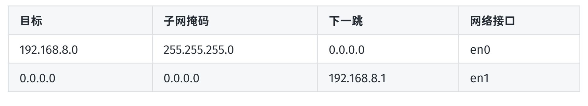

# 数据传输过程

## 数据包封装和解封装过程

TCP/IP 模型每个层都有各⾃的功能和分⼯，当有⽤⼾数据想要发送给另⼀台设备的时候，数据⾃上⽽下，从应⽤层向链路层传递有⼀个复杂的过程。

以 Telnet 为例，Telnet 在传输层是使⽤ TCP 协议的：
- 数据从应⽤层进⼊，到达传输层，添加上 TCP⾸部，将数据加⼯成 TCP 段，称为 Segment。这是为了保证数据的可靠性。
- 接着数据到达⽹络层，在⽹络层使⽤ IP 协议，被添加上 IP ⾸部，将数据加⼯成 IP数据报，称为datagram 。经过⽹络层 IP 协议的加⼯，指定⽬标地址和 MAC 地址，保证数据准确的发送到⽬标机器。
- 接着数据到达链路层，添加上以太⽹头部，将数据加⼯成以太⽹帧，称为 frame，包含了⽹卡等硬件相关的数据。

> 通过上⾯的数据⾃上⽽下的加⼯流程图可以看出，⽆论⽹络层是不是⽤的 IP 协议，⽆论传输层⽤的是 TCP 还是 UDP，最后的成品实际上就是⼀个以太⽹帧。

## 数据在网络上的传输过程

这⾥先不说域名的事⼉。

在发送数据的时候，绝⼤多数的情况下发送端只知道⽬的端的 IP 和 接收端⼝，这也是传输层（TCP 或 UDP）必须的，经过层层包装后，拿以太⽹来说，真正跑到⽹络上的数据最终必须是⼀个完整的以太⽹帧，⽽以太⽹帧中必须要⽤⽬的端的 MAC 地址。

当发送端开始组装数据的时候，⾸先会检查⽬的IP 和⾃⾝的IP 是否处在同⼀个⽹络中。计算⽅式就是⽤ IP 地址和⼦⽹掩码进⾏「与运算」。如果得到的⽹络地址是⼀致的，说明在同⼀个⽹络中，这时发送端检查⾃⼰的 ARP 表中是否有⽬的IP 对应的 MAC 地址。如果有的话，直接将 MAC 地址组装到以太⽹数据帧中，发送数据帧，数据就能被⽬的端顺利接收。如果ARP 表中不存在⽬的IP对应的 MAC 地址，则向本⽹络⼴播发送 ARP 请求，ARP 请求会带着⽬的IP地址，意思就是询问“谁的IP地址是这个，请回复你的MAC地址给我”，⽹络中的主机看到后，如果IP是⾃⼰的，就返回给发送端⼀个ARP回复，回复中带着⾃⼰的MAC地址，发送端拿到MAC地址后，先存⼊本地的ARP表，然后组装以太⽹帧，将数据发送。如果得到的⽹络地址不⼀致，说明⽬的端不在本⽹络中，那就要通过各种路由器、交换机等中间设备了。

要发送到其他⽹络，就要经过路由器，路由器中维护着⼀张路由表，主要存放⽹络、主机与下⼀跳的对应关系。例如下表这样：

⼤致的意思就是如果收到⼀个数据报，在当前路由器的路由表中寻找，⼀般⽬标都是⼀个⽹络地址（标明⼀个⼦⽹），把具体数据包的IP地址和当前路由表的⼦⽹掩码进⾏与操作，如果得到的结果和路由表⽬标栏一致，就转发给这个表⽬的下⼀跳地址，从⽹络接⼝栏所记录的接⼝发出（也就是路由器上的⽹⼝）。

如果下⼀跳地址是0.0.0.0 ，表⽰这个⽬的IP地址就在当前⽹络中。那就不⽤路由器转发了，拿到⽬的IP的MAC地址，就可以直接发送了（获取MAC地址的⽅法，前⾯说过了，先查ARP表，没有的话，再⽤ARP⼴播请求获取）。

如果下⼀跳不是0.0.0.0，表⽰⽬的IP不是本⽹络的地址，就发给下⼀跳的地址。

如果在路由表中都没有找到匹配的⽬标⽹络，那就看有没有配置默认条⽬了，默认条⽬也就是⽬标是0.0.0.0的条⽬，表⽰任意的IP都可以通过此条⽬的下⼀跳（也就是默认⽹关）地址转发出去。

如果在路由表中没有找到任何匹配的⽬标⽹络，并且没有设置默认条⽬，那就直接将数据包丢弃，并返回⼀个 主机不可达的 ICMP 请求。

## 几种常用的协议

### 应用层协议

HTTP、HTTPS、FTP、SFTP、SSH

### 传输层协议

TCP、UDP

### 网络层协议

IP、ARP、RARP

ARP 根据 IP 地址得到 MAC；RARP 根据 MAC 得到 IP 地址

### 链路层协议

一般指以太网帧协议
