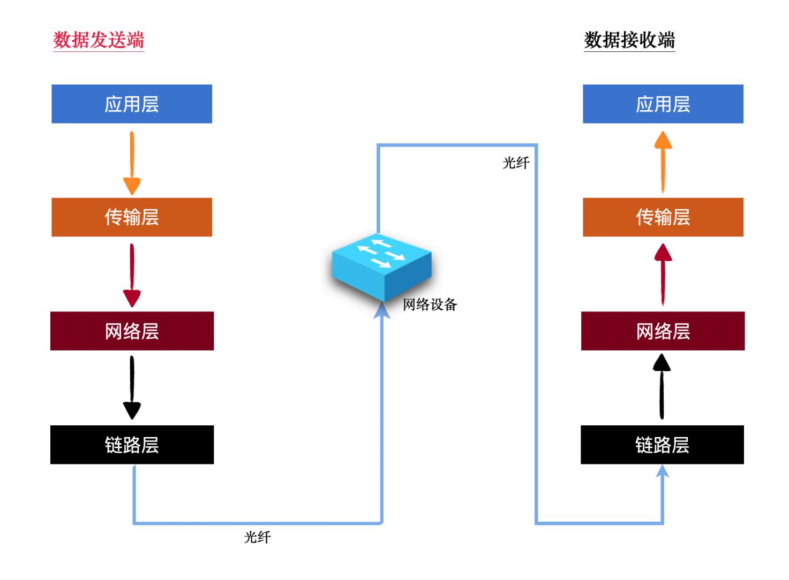
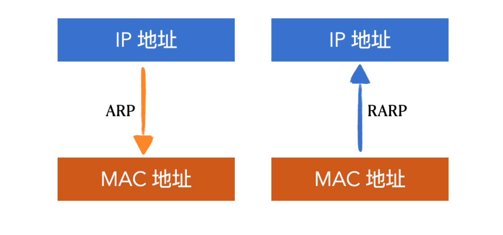
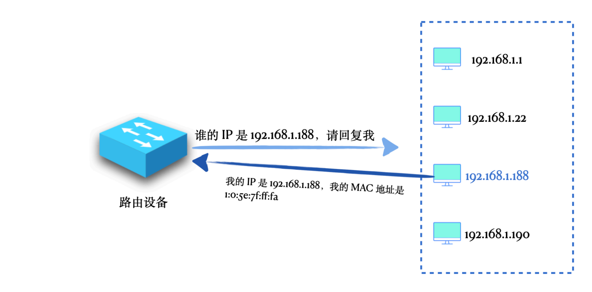
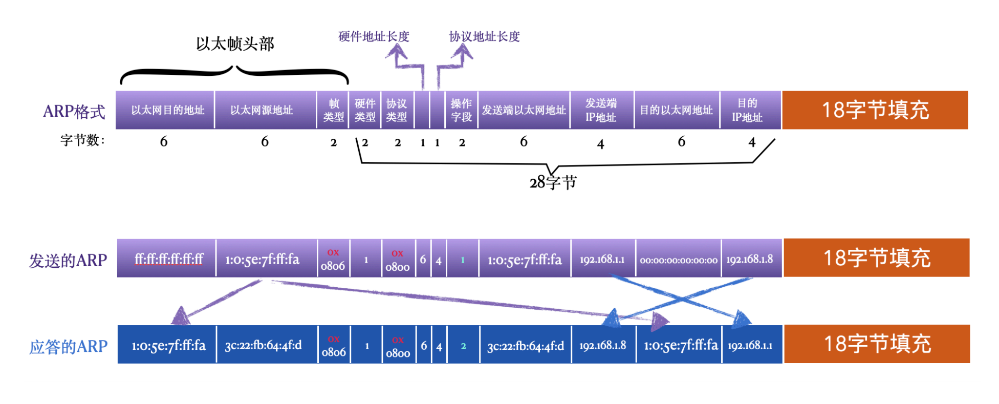
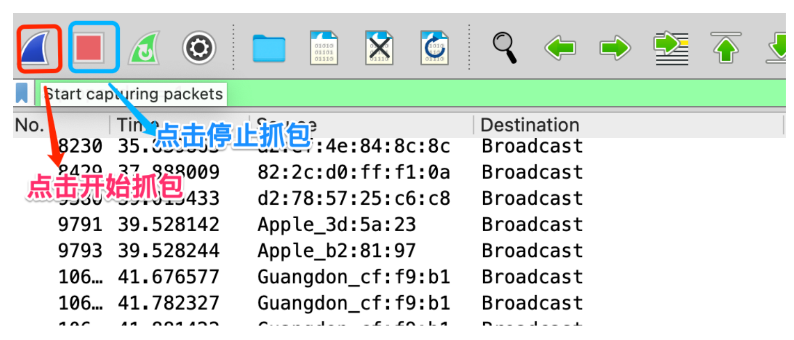
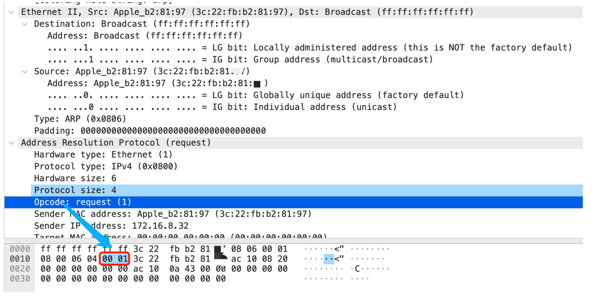
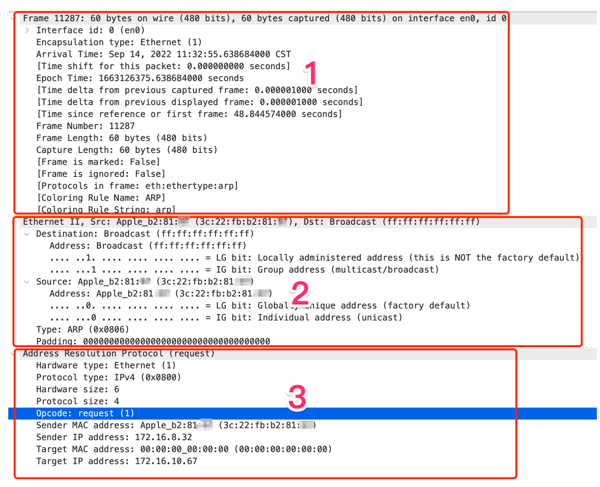
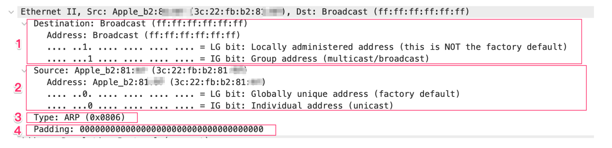
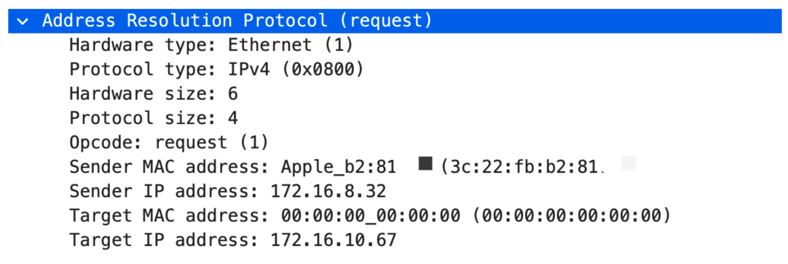

# ARP协议

ARP 协议（地址解析协议）可以简单概括为⼏句话：
- ARP ⼯作在局域⽹内
- ARP 的作⽤是根据 IP 地址获取对应的 MAC 地址
- 在⽹络中最终传输的数据叫做数据帧，是数据链路层最后封装的，⽽数据帧要根据 MAC 地址找到⽬的主机，⼀般是⽬的主机的某个⽹卡
- ⽽⼀般我们只知道⽬的主机的 IP，不知道 MAC 地址，所以需要 ARP 协议

在 OSI 模型中，通常认为 ARP和RARP属于数据链路层协议，因为它们不使⽤IP协议。⽽在TCP/IP协议栈中，将 ARP归于⽹络层，和IP协议在同⼀层。

只要知道对⽅的 IP 地址或域名，就能将数据发送过去，这是我们常识性的理解。⽽且在平常的使⽤过程中也确实是这样的。⽐如我们开发过程中，建⽴⼀个 socket 连接，只要知道⽬标 IP 和 端⼝就可以了。真实的⽹络世界中是这样的吗，确实 IP 地址是必不可少的，但是还有另外⼀种地址也是必不可少的，那就是 MAC 地址。

最终，在数据到达以太⽹链路层，会被包装成以太⽹数据帧，⽽数据帧中决定最终去向的就是⽬标MAC 地址，注意喽，是 MAC 地址（硬件地址），⽽不是 IP 地址。

可以把 IP ⽐作现实世界中⼀个房⼦的标记，⽐如北京市朝阳区XX路xx⼩区1号楼1单元801，⽽ MAC地址则是这个房⼦的经纬度（116.354856,39.942009），虽然我们看前⾯的⼀串标⽰更容易理解，但是当我们要导航去那⾥的时候还是要靠经纬度。

但是如何在⼀⼤群机器中确定⽬标 IP 对应的 MAC 地址呢，数据已经到了局域⽹，这么多⼤⻔该开哪⼀扇呢，这就是 ARP 该做的事⼉了。

## 什么是MAC地址

MAC地址（Media Access Control Address），直译为媒体存取控制位址，也称为局域⽹地址（LAN Address），以太⽹地址（Ethernet Address）或物理地址（Physical Address），它是⼀个⽤来确认⽹路设备位置的位址。在OSI模型中，第三层⽹路层负责IP地址，第⼆层数据链结层则负责MAC位址。MAC地址⽤于在⽹络中唯⼀标⽰⼀个⽹卡，⼀台设备若有⼀或多个⽹卡，则每个⽹卡都需要并会有⼀个唯⼀的MAC地址。

MAC 地址⻓度为6字节，48bit，⽤16进制的6个元组表⽰，例如 `3c:22:fb:64:4f:1d`，其中有⼀个特殊的地址就是所有⽐特位都是1的地址 `ff:ff:ff:ff:ff:ff`，表⽰是⼀个⼴播地址，意思就是指消息要发给局域⽹中的所有⽹卡。

## 为什么需要 ARP 协议

直接的原因就是数据链路层要将数据帧发送到⽬的端，必须要知道⽬的端的 MAC 地址，这是由⽹络模型的架构设计决定的。

ARP 协议全称地址解析协议，⽤来将 IP 地址解析出 MAC 地址，还有⼀个与之相对的协议 RARP，全称叫做逆地址解析协议，⽤来将 MAC 地址解析出 IP 地址。

## ARP的工作过程

ARP 就是⼯作在⼀个局域⽹中的

当⼀台路由器或者⼀个具有路由转发功能的主机想要通过⼀个 IP 地址得到对应的 MAC 地址时，就可以使⽤ ARP 协议了，这个设备向它所在的⽬标⼦⽹中发送⼀个⼴播的 ARP 请求，请求中带着这个 IP 地址，意思是说，在这个⽹络中的各位，谁的 IP 是这个，请回复我⼀下，并告诉我你的 MAC地址。收到这个请求的主机对这个 ARP 包进⾏解析，如果发现携带的 IP 正好是⾃⼰的，就返回⼀个 ARP 回复，回复中带上⾃⼰的 MAC 地址。

使⽤ ARP 协议后，⽬的主机将⾃⼰的 IP 地址和 MAC 地址返回给源主机，源主机将 MAC 地址加到以太⽹帧中，构造成完整的帧格式，再将数据帧通过链路层发出。

最终数据帧到达⽬的主机，链路层通过数据帧中的⽬的 MAC 地址判断数据帧是不是发给⾃⼰的，如果是的话，则接收数据帧，并经过层层解析，最终交给应⽤层对应的程序处理。

## 先说说以太网数据帧格式

- 以太⽹⽬的地址：⽬的端 MAC 地址，6字节。
- 以太⽹源地址：发送端的 MAC 地址，6字节。
- 帧类型：标记数据部分的类型，如果是 IP 数据报，值为 0x0800，如果是 ARP 数据报，值为0x0806，2字节
- 数据：以太帧搭载的数据。只要是在以太⽹上发送数据，最终都会被链路层封装成以太⽹数据帧，所以数据部分即可以是 IP 数据报、ARP 协议包、ICMP 数据包等，以太⽹数据帧数据部分最⼩⻓度是 46 字节，最⼤⻓度由 MTU 决定，是 1500 字节。
- CRC：数据检验码，⽤来在接收端检验接收的数据是不是⽆差错的，4字节。

## ARP协议格式

以下是 ARP 协议的格式，以及⼀对完整的 ARP 请求数据帧和应答数据帧。

- 硬件类型：2字节，⽤来表⽰硬件地址的类型，为 1 表⽰以太⽹地址。
- 协议类型：2字节，⽤来表⽰要映射的协议地址类型。ARP 不仅可以表⽰要将 IP 转换为 MAC ，还允许其他的转换关系，例如将另外⼀种⾮ IP 地址转换为 MAC 地址。当它的值为 0x0800 表⽰ IP 地址，与包含IP数据报的以太⽹数据帧中的类型字段的值相同。
- 硬件地址⻓度：1字节，⽤来表⽰硬件地址的⻓度，单位是字节。在以太⽹中就是 MAC 地址的⻓度，值为6，也就表⽰ MAC 地址⻓度为 6 字节。
- 协议地址⻓度：1字节，⽤来表⽰协议地址的⻓度，单位是字节。在以太⽹中，如果协议类型是 IP，也就是要将 IP 转换为 MAC 时，它的值是 4 ，也就是4字节，表⽰ IP 地址的⻓度是 4 字节。
- 操作字段：2字节，⽤来表⽰当前操作的类型。值为1，表⽰ ARP 请求；值为2，表⽰ ARP 应答；值为3，表⽰ RARP 请求；值为4，表⽰ RARP 应答。此字段是⽤来区分请求和应答的必需字段。
- 发送端以太⽹地址：6字节，⽤来表⽰发送端的以太⽹ MAC 地址。
- 发送端 IP 地址：4字节，⽤来表⽰发送端的 IP 地址。
- ⽬的以太⽹地址：6字节，⽤来表⽰⽬的端的 MAC 地址。
- ⽬的 IP 地址：4字节，⽤来表⽰⽬的端的 IP 地址。

整个 ARP 协议部分共 28字节，但是在以太⽹中，⼀个以太⽹数据帧数据最⼩⻓度为 46，所以，后⾯要有18字节的数据填充。

操作字段为1表⽰这是⼀个 ARP 请求，ARP 请求是个⼴播消息，请求数据中没有⽬的 MAC 地址，因为还不知道嘛，我们要找的就是它。之后，ARP 应答消息（操作字段是2）将本机的 MAC 地址放到源MAC地址中，并且将 ARP 请求中的MAC地址替换为⽬的 MAC 地址，⽤来告知 ARP 发送端。

### 用Wireshark抓个包

在 Wireshark 中过滤 arp.opcode #% 1 的 ARP 请求，然后找到其中⼀个。⽤ Wireshark 分析包特别直观，我们⽤⿏标点击上⽅的某个字段时，下⾯会⾃动将这个字段的值标记出来，这样就可以清楚的看到这个字段在整个数据包中的位置了。例如下图选中了 ARP 包中的 Opcode字段（操作字段），下⾯的 00 01 被标记了，这是⽤ 16 进制表⽰的， 00 表⽰⼀个字节， 01 表⽰⼀个字节，表⽰这个操作字段是2个字节，值是1，也就是ARP 请求。

### 简单分析这个包

图中 1、2、3 三个部分分别是以太⽹帧概要信息、以太⽹数据帧⾸部、以太⽹数据帧数据内容。在第⼀部分概要信息可以看到这个帧的总⼤⼩是 60 bytes，以太⽹数据帧头部的14 字节，加上内容部分最少46字节，刚好是 60 字节，其实还有⼀个 CRC （数据检验码），只不过本地⽹卡会⾃动剥离掉，所以在 Wireshark 中是看不到的。

#### 以太网帧首部

上图是以太⽹数据帧⾸部信息。

- ⽬的 MAC 地址，都是 ff ，表⽰这是个⼴播请求，ARP 请求本⾝就是⼴播的。
- 源 MAC 地址，本机的 MAC 地址。
- 帧类型，ARP 类型。
- 因为以太⽹帧数据部分最⼩是 46 字节，ARP 只有28字节，所以要填充18字节。

#### ARP 请求信息

从上到下依次是硬件类型、协议类型、硬件地址⻓度、协议地址⻓度（⼀般就是IP地址）、操作字段、发送端 MAC 地址、发送端 IP 地址、⽬标 MAC 地址、⽬标 IP 地址。使⽤ wireshark 的 filter `arp.opcode == 2` 可过滤出 APR 请求。

