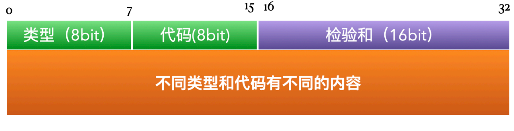
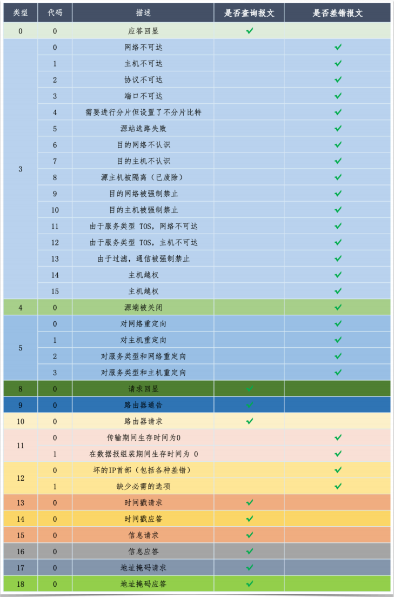
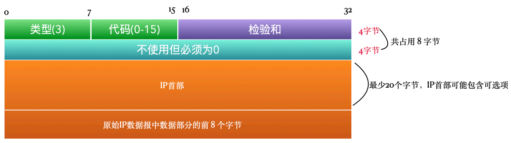
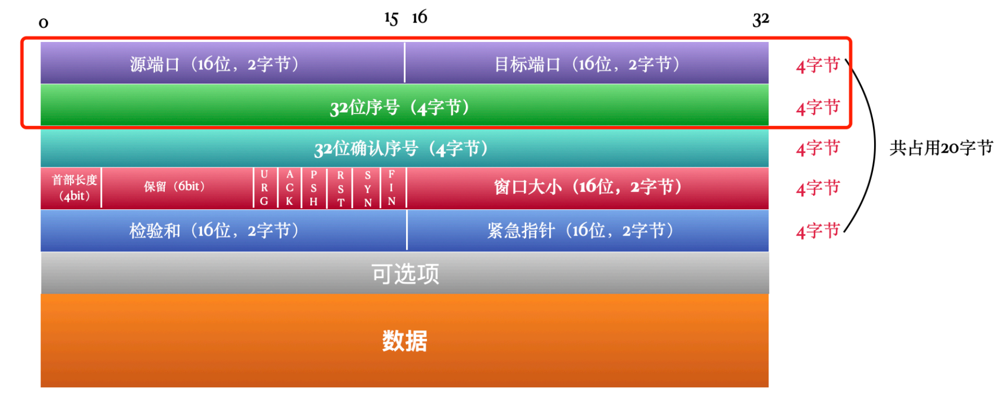
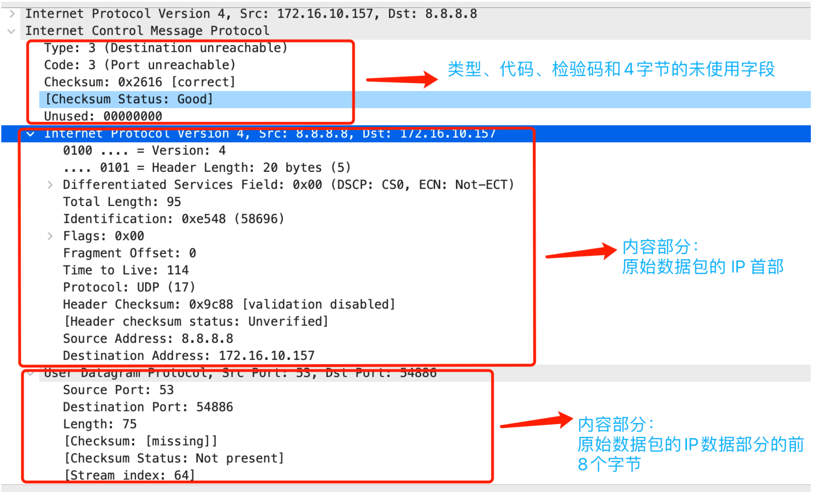

# ICMP协议

ICMP 全称互联⽹控制报⽂协议（Internet Cntrol Message Protocol），是⽹络层的重要协议。

## ICMP 是⼲啥⽤的

ICMP 分为查询报⽂和差错报⽂两⼤类。查询报⽂是我们主动发起的，⽐如ping命令；⽽差错报⽂是在发⽣差错之后要发给源端的，这都是互联⽹协议模型约定好的。

ICMP的差错报⽂反馈发⽣在通信环境中的遇到的各种问题。通过这些信息，使管理者可以对所发⽣的问题作出诊断，然后采取适当的措施解决。

ICMP的差错报⽂是整个数据传输链路中⾮常重要的⼀个环节。打个⽐喻，差错报⽂就是⼀个只报告坏消息的信使，当数据包在⽹络中⼀路畅通的时候，ICMP 差错报⽂就像隐⾝了⼀样，你根本不会知道它的存在，⼀旦数据包在⽹络中碰到了各种各样的障碍，这个信使就出来活动了，它的⽬的只有⼀个，就是把这个数据包遭遇的不测通知给发送端，但是话术就那么20多种（对应差错代码）。

比如下面场景：
- 当路由器收到⼀份IP数据报但⼜不能转发时，就要发送⼀份 ICMP「主机不可达」差错报⽂。
- 当IP数据报应该被发送到另⼀个路由器时，收到数据报的路由器就要发送 ICMP「重定向」差错报⽂给IP数据报的发送端。

## ICMP 协议说明

虽然⼯作在⽹络层，看上去和 IP 协议是并列的，但是 ICMP 报⽂要附加 IP 头，⼀般被 IP 层或者更⾼层的协议（例如TCP或UDP）使⽤。很少有应⽤程序直接使⽤ ICMP 协议，除了ping 、 traceroute。

## ICMP 协议格式

ICMP 协议格式和 IP 协议、TCP 协议这些⽐起来，那还是⾮常简单的。

- 类型：类型字段占⽤ 8 位，主要定义报⽂的⼤类，⽐如类型为 3 统⼀表⽰的是 不可达 ，⽽具体原因是什么则要由代码字段决定。
- 代码：代码字段同样占⽤ 8 位，代码字段其实就是类型下的⼦类型，⽐如上⾯说了类型为 3 是不可达，代码为 0 表⽰⽹络不可达，代码为 1 表⽰主机不可达。
- 检验和：⽤于错误检查，和 IP 协议的检验和的作⽤⼀致。
- 内容：因为类型和代码不同，表⽰产⽣差错的原因不同，不同的原因都要有对应的描述，内容这部分就是⽤来描述产⽣差错的原因的。

## ⽬的不可达差错报⽂

⽬的不可达是⽹络传输中经常遇到的问题，各位在开发的过程中可能也碰到过，尤其是做⽹络编程的时候，经常会碰到，⽐如连错IP了，⽐如端⼝设置错了。

通过上表可知，当类型为 3 的时候，都是不可达的错误，⽽代码可以爛 0 -15，也就是说有16种不可达的具体原因。这种情况下的协议格式是下⾯这样的。

类型为 3 ，代码 0 - 15。检验和后⾯有 4 个字节的空间是不使⽤的，但是必须为0 ，没理由，就这样。

前⾯说到了内容部分是根据类型和代码不同⽽不同的。如果是⽬的不可达，也就是类型是 3 的情况下，内容分为两部分，IP⾸部和原始IP数据报中数据部分的前 8 个字节。

原始IP数据报中数据部分指的就是TCP或者UDP这些⽹络层之上的协议，拿 TCP 来说，TCP 是传输层的，当 TCP 数据报到达⽹络层，会加上 IP ⾸部，变成⼀个 IP 数据包。所以这⾥说的数据部分就是 TCP 数据报，但是这个数据报可能很⼤，所以只⽤前 8 个字节就够了，因为前8个字节包含的信息已经⾜够⽤了。

回想⼀下 TCP 协议的格式，前 8 个字节就是下图红框部分，包含源端⼝和⽬的端⼝以及序号。

例如代码为 3 的时候，差错信息是端⼝不可达，那有了 TCP 协议的前8个字节就能知道导致这个错误的原始数据报⽂中的⽬的端⼝是多少，不可达的端⼝也就是这个端⼝。也可以知道原始报⽂的源端⼝是多少，有了源端⼝号就知道这个数据包是哪个⽤⼾进程发出来的，就可以交给这个进程对这个差错及时进⾏处理了。

下⾯是⼀个端⼝不可达的差错报⽂，⽤ WireSharek 监测到的格式。

telnet ⼀个没有开放的端⼝即可获得 ICMP 端⼝不可达的差错报⽂。

## 查询报文

将 ICMP ⽤作查询报⽂的场景⽐较少，⽤作查询报⽂的意思就像是使⽤ ARP 协议或者 TCP 协议这种，是我们主动发起的，只不过选了 ICMP 协议。

⽐如 ping 和 traceroute 这两个，之后我们再讲，这两个⽐较有意思，对 ICMP 应⽤很巧妙。

另外，可以⽤作⽆盘系统启动过程中来获取⾃⾝的⼦⽹掩码。还可以⽤作向第三⽅系统查询当前的时间戳。

了解⼀下就可以了。

## 有⼀些场景不发送差错报⽂

有些场景下是不发送差错报⽂的，这样做的⽬的是为了防⽌ICMP差错报⽂带来⼴播⻛暴。
- ICMP差错报⽂本⾝发⽣差错，是不会对差错报⽂再发送差错报⽂的。是不是读起来有点绕，TCP 、UDP 出错会发送差错报⽂，但是 ICMP差错报⽂在通知源端的过程出错了，那就不管了，要不然可能就没玩没了的发了，⽐如源端的⽹线断了。但是， ICMP查询报⽂可能会产⽣ICMP差错报⽂，⽐如ping命令在传输过程中出错了，源端会收到差错报⽂。
- ⽬的地址是⼴播地址或多播地址（D类地址）的IP数据报，不发送差错报⽂。
- 作为链路层⼴播的数据报，不发送差错报⽂，ARP 就是典型的链路层⼴播数据报。
- 不是IP分⽚的第⼀⽚，不发送差错报⽂。数据如果过⻓，⽹络层是会进⾏分⽚的，这些分⽚实际上还是同⼀个数据包的，这种情况下只对第⼀⽚发送差错报⽂，其他分⽚不管。
- 源地址不是单个主机的数据报，不发送差错报⽂。 源地址不能为零地址、环回地址、⼴播地址或多播地址。

## 总结

- ICMP 在⽹络层，但要加上 IP ⾸部
- ICMP 分为查询报⽂和差错报⽂，主要⽤到的还是差错报⽂
- ICMP 的差错报⽂就好像⼀个只通知坏消息的信息，当数据报在⽹络中出现问题的时候，及时告知源端，告知的内容包括原因以及产⽣错误的原始数据报的必要部分
- 有⼀些情况是不会发送 ICMP 差错报⽂的，这样做是为了防⽌⽹络⻛暴

