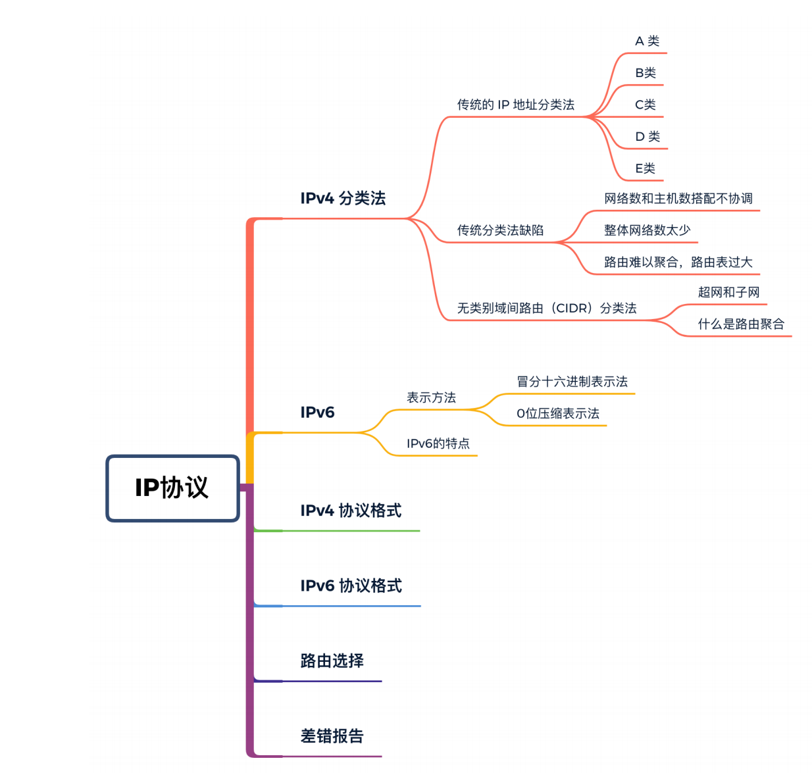
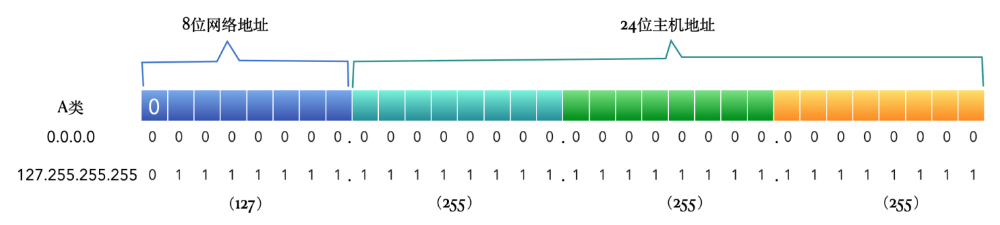

# IP协议

IP协议是TCP/IP协议簇中最核⼼的协议，⼤部分的上层（传输层、应⽤层）应⽤都直接或间接的使⽤IP协议传输，TCP协议、UDP协议也会使⽤ IP 协议。

IP 协议是⽆连接的，不可靠的⽹络层协议，它只负责数据的传输，但是并不能保证数据⼀定能到达，要想保证数据可靠，需要上层应⽤处理，例如 TCP协议利⽤IP协议传输数据，但是丢包、超时等情况还是要靠 TCP ⾃⼰解决。

## IPv4分类法

### 传统分类法

在互联⽹诞⽣之初，IP 地址就有⼀套标准的分类⽅法，因为当时互联⽹上的设备还很少，需要⽤到IP 的企业和机构也没有那么多。谁知道后来互联⽹发展的如此迅猛，导致这种分类⽅式⽤起来不太合理。

这种分类⽅式是将 IP 地址分成 A、B、C、D、E 五类，每⼀类都有固定的前缀和应⽤场景。

⼀个 IP 地址占⽤ 32 bit ，⽤点分⼗进制表⽰，例如 192.168.0.188，⼀个点号分隔⼀个 8 bit。

- IP 地址可分为 A、B、C、D、E 五类，D类是⼴播地址，E类是保留地址（未启⽤），所以重点关注 A、B、C 类
- A、B、C 类地址分为⽹络地址和主机地址，⽹络地址表⽰⼀个⽹络，主机地址分给具体的主机
- 主机地址全为 0 和全为 1 的IP 有特殊⽤途，主机地址全为 0 ，表⽰⽹络号，代表这个⽹络本⾝；主机地址全为1，表⽰⼴播地址，代表这个⽹络中的所有主机
- 每个类别中（除了 D、E类），都有⼀些地址有特殊的⽤⼾，留作私有地址或者回环地址，例如192.168、127.0.0.1
- ⼦⽹掩码全为1的位数就是⽹络地址的位数

#### A类

A 类地址前 8 位为⽹络地址，后24位为主机地址。

⽹络地址中第⼀位固定为0，有爛0~127共128个⽹络，每个⽹络可容纳 $2^{24} - 2 = 16,777,214$ 台主机。但其实可⽤的 IP 地址从 [1.0.0.0]~[126.255.255.255]。

##### 特殊网络地址

但其中⽹络地址全0和全1的为特殊地址，不能使⽤，所以 A 类地址可⽤的⽹络数其实是 126个。

127.0.0.1，这个地址我们都⾮常熟悉，⼀般我们说这个是本地地址（localhost），其实这个地址准确的名称叫做「回环地址」，可以理解为⼀个虚拟⽹卡，这个⽹卡只接收来⾃本机的数据包。0.0.0.0，这个地址其实才代表本机，假设⼀台主机上有两个⽹卡，⼀个服务监听了 0.0.0.0 这个IP，则发给这两个⽹卡的数据都会被监听到。

还有⽹络地址 10 开头的地址⽤作内⽹地址，从 `10.0.0.0` ~ `10.255.255.255`。好多公司的内⽹ IP 都是10⽹段的。

##### 特殊主机地址

每⼀个⽹络，主机地址全 0 和 全 1 的都是保留地址，所以每⼀个⽹络的主机数都是 $2^{n} - 2$，n 是主机地址的位数。

#### B类

16位⽹络地址，16位主机地址。⽹络地址中前两位固定为 10，有 $2^{14} = 16384$ 个⽹络，每个⽹络可容纳 $2^{16} - 2 = 65534$ 台主机。

但其实可⽤的 IP 地址从 `128.0.0.0` 到 `191.255.255.250`。

##### 特殊网络地址

`172.16.0.0` ~ `172.31.255.255` 是私有地址。

`10101100.0001000.00000000.00000000` ~ `10101100.00011111.11111111.11111111`

`169.254.0.0` 到 `169.254.255.255` 是保留地址。

`10101001.11111110.00000000.00000000` ~ `10101001.11111110.11111111.11111111`

##### 特殊主机地址

每⼀个⽹络，主机地址全 0 和 全 1 的都是保留地址，所以每⼀个⽹络的主机数都是 $2^{n} - 2$，n 是主机号的位数。

#### C类

24位⽹络地址，8位主机地址。⽹络地址中前三位固定为110，有 $2^{21}$ 个⽹络，每个⽹络可容纳 $2^{8} - 2 = 254$ 台主机。

但其实可⽤的 IP 地址从 `192.0.0.0` ~ `223.255.255.255`。

##### 特殊网络地址

`192.168.0.0` 〜 `192.168.255.255` 留作私有地址使⽤。

#### D类

D类地址以 1110 开始，并且不区分⽹络地址和主机地址，这类地址⽤作是⼴播地址，⽤来接收⼴播消息

#### E类

E类地址以1111开始，保留地址，还未启⽤。

### 传统分类缺陷

- ⽹络数和主机数搭配不协调：A类、B类可⽤⽹络数很少，只有1万多个，但是每个⽹络的主机数⼜太多了，现实中没有哪个机构或企业的主机数会有那么多，所以如果⼀个企业得到⼀个B类地址，其实只能⽤到很少的主机地址，剩下的就浪费了。
- 整体网络数太少：A、B、C类的⽹络数加起来只有200多万个，但是全世界有那么多机构、企业，每个企业都申请⼀个⽹络地址，显然是不够⽤的。
- 路由难以聚合，路由表过大：虽然200多万的⽹络数据量在全世界范围内不算多，但是对于⼀个路由器的路由表来说就太多了。假设⼀个地区有⼗⼏万个 C类地址，那路由器想要路由这些地址，就要在路由表中记录这么多的路由表项，显然是不太合理的。

## 无类别域间路由（CIDR）分类法

正是因为传统的A、B、C、D、E类分法的⼀些缺陷，CIDR 便应运⽽⽣。

CIDR 纜然是⽤点分⼗进制的⽅式表⽰，IP v4 中纜然是 32 位，每8位⼀组，共4组。只是需要在后⾯加⼀个数字后缀，表⽰这个地址的⽹络地址是多少位。

传统的分类⽅法是以 8 位为最⼩单元，⽹络地址只能是8位、16位、24位，⽽在 CIDR 中⽤⼦⽹掩码区分⽹络地址和主机地址，连续为1的位数就是⽹络地址位数，⽤⼆进制可以清楚的看出来。

例如⼦⽹掩码是 `11111111.00000000.00000000.00000000`，前⾯8位连续都是1，表⽰8位的⽹络地址，⼦⽹掩码就是 `255.0.0.0`。

再⽐如⼦⽹掩码是 `11111111.11100000.00000000.00000000`，前⾯11位连续都是1，表⽰11位的⽹络地址，⼦⽹掩码就是 `255.224.0.0`。这与传统的 IP 地址分类法就不⼀样了。

看下⾯两个 CIDR IP 地址，⼀个 11位⽹络地址的 IP ，⼀个 22 位⽹络地址的 IP。

例如 `209.34.21.7/11`，表⽰前11位代表⽹络地址，后⾯的21位都是主机地址。

`207.128.28.4/22`，表⽰前22位是⽹络地址，后⾯10位是主机地址。

### 超网和子网

IP 地址的申请有专⻔的管理机构控制，互联⽹地址顶级指派机构会负责分派超⼤地址块，地址块就是⼀个IP下包换的 IP 地址集合。 这些超⼤地址块会分配给⼤型⽹络提供商，⼤型的⽹络提供商⼜可以再分派⼩⼀些的地址块，这些⼩的地址块会分配给中型、⼩型的⽹络服务提供商，最后⼀些企业或机构再跟这些中⼩型的⽹络服务提供商申请供内部使⽤、有对外功能的 IP 地址。

这些分配给⼤型⽹络提供商的超⼤的地址块就可以被称为超⽹，下⾯分派出去的地址块可以被称为⼦⽹。当然这个超⽹和⼦⽹的概念是相对的，对于⼀个企业⽽⾔，分给它 IP 的⽹络服务提供商所拥有的⽹络就是超⽹。

上图这个例⼦中，假设 `209.32.0.0/11` 这个11位前缀的⽹络被分给了⼀个⼤型⽹络服务提供商A，那它可分配的地址数⾼达 200多万个，可想⽽知，没有任何⼀家企业或机构需要这么多个 IP 地址吧。

B 是⽐较⼤的企业，财⼤⽓粗，它去找A申请，于是 A 将 `209.34.20.0/22` 这个前缀⻓度为22位的地址块分给了 B 。B 的旗下还有分公司，于是它⼜将 `209.34.21.0/24` 这个地址块分给了其中的⼀个⼦公司。于是这个⼦公司就拥有了200多个 IP 地址，⽐如 `209.34.21.1/24`。

### 什么是路由聚合

前⾯在说传统分类⽅式的时候，提到了⼀个缺点，就是路由难以聚合，可能会导致路由表过⼤，⼀个路由表可能要存上万、甚⾄更多的 C类地址记录。

CIDR 正好可以解决这个问题，这就是我们所说的路由聚合能⼒。那什么叫路由聚合呢。路由聚合的意思是根据前缀进⾏聚合，有⼀些⽹络地址块它们虽然是不同的，但是他们的⼀部分前缀是相同的，这也是⼆进制的特性决定的。

⼗进制的 8 和 9是完全不同的两个数对不对，但是我们把它们改为⼆进制的看⼀下，就会发现他们的前三位都是⼀样的。

看下⾯这张图中的例⼦，是将两个20位前缀的⽹络聚合为⼀个19位前缀的路由。

我们看到上⾯这两个⽹络 `209.34.48.0/20` 和 `209.34.32.0/20`，它们的前19位⼆进制都是完全⼀致的，上⾯说到的，相同就可以聚合，所以将前19位聚合，聚合成⼀个 19位前缀的⽹络，也就是`209.34.32.0/19`。

当有访问到 `209.34.48.0/20` 和 `209.34.32.0/20` 这两个⽹络中的地址时，其实它们两个对外都是显⽰的 `209.34.32.0/19`，也就是说这两个⽹络都会命中 19位前缀的路由记录，也就缩⼩了这个路由器的记录规模，⽽到哪个具体的 IP，就靠⼦⽹络中的路由了。

这相当于⼀种分⽽治之的策略，保证顶层路由表不会过⼤，⼦路由表也不会过⼤。

## IPv6

即使有了 CIDR 分类法，IPv4 的数量依然⼗分紧俏。⽬前 IPv4的地址已全部分配完毕，分到中国的⼤概有3亿多，⽽中国的终端设备这么多，⼤多数情况下要多个设备共⽤⼀个地址，这种情况下就要借助 NAT 技术了。

### 什么是NAT

NAT 就是让多个内⽹主机，转成⼀个公⽹IP来连接互联⽹。拿平时⽤微信聊天来说，我们在公司的时候那么多同事共⽤⼀个热点，消息是怎么来回发送，⽽且每次都准确的到达终端的呢。

当发送消息的时候，消息经过 NAT 设备的转发，将发送地址变换为当前⽹络对外的公⽹地址；

当接收到消息时，消息经过 NAT 设备，根据 NAT 设备记录的信息(和端⼝号有关)，将消息转发给对应的内⽹终端。

但是 NAT 会导致⽹络的性能变差，⽽且 NAT 也是有数量限制的。这就使得 IPv6 势在必⾏了，⽬前，有很⼤⼀部分互联⽹公司都已经⽀持 IPv6了。

IPv6地址⻓度为 128位（bit），是IPv4的4倍。其所包含的 IP 个数为 $2^{128}$ 个，这个数字太⼤了，这么说吧，按照现在的⼈⼝数，随便⽤，根本就⽤不完。

### 表示方法

#### 冒分十六进制表示法

⽤ 8 组冒号分隔的16进制数分隔，例如 `2408:8207:2462:bcc0:89b:16e1:771d:4bec`

#### 0位压缩表示法

在某些情况下，⼀个IPv6地址中间可能包含很⻓的⼀段0，可以把连续的⼀段0压缩为“::”。但为保证地址解析的唯⼀性，地址中”::”只能出现⼀次，例如：

`FF01:0:0:0:0:0:0:1101` → `FF01::1101`

`0:0:0:0:0:0:0:1` → `::1`

`0:0:0:0:0:0:0:0` → `::`

### Ipv6特点

1. IP地址依然适应互联⽹分层构造。分配与其地址结构相适应的IP地址，尽可能避免路由表膨胀。
2. 包⾸部⻓度采⽤固定的值 （40 字节），不再采⽤⾸部检验码。简化⾸部结构，减轻路由器负荷。路由器不再做分⽚处理(通过路径 MTU 发现只由发送端主机进⾏分⽚处理），提升了性能。
3. ⽀持即插即⽤功能，即使没有DHCP 服务器也可以实现⾃动分配IP 地址。
4. 采⽤认证与加密功能，应对伪造 IP 地址的⽹络安全功能以及防⽌线路窃听的功能 (IPsec)。

## IPv4 协议格式

- 版本：版本字段占⽤ 4 bit，⽤来标⽰当前使⽤的 IP 协议版本，只有 IPv4（0100） 和 IPv6（0110） 两个版本区分。
- ⾸部⻓度：⾸部⻓度表⽰占32bit的数⽬，也就是有多少个4字节（32bit/8=4字节），⽐如⾸部⻓度是5，就表⽰有5个4字节，也就是20个字节。⽽⽤来表⽰⾸部⻓度的字段是4bit，这样⼀来它可表⽰的最⼤⻓度就是⼆进制的「1111」，也就是2^4-1=15，也就是最⼤可以是 15个4字节，也就是`15*4=60`个字节，也就是说⾸部的最⼤⻓度是60个字节，⽽通过图可以看出来固定的部分占20字节，那可选项部分的最⼤⻓度就是40字节。
- 服务类型：服务类型，英⽂全称 Type of Service。⽤来标⽰是⼀个什么类型的应⽤正在使⽤IP协议。前⾯ 3 个bit ⽤来标⽰优先级，但现在已经被忽略了。接着 4 个bit ⽤来标⽰⼦类型，每⼀个bit分别代表最⼩延迟、最⼤吞吐量、最⾼可靠性、最⼩费⽤。例如 Telnet 应⽤要求最⼩延迟，所以这4个bit分别是 「1000」。最后⼀个bit是保留位，但必须是0。但是现在很少有应⽤⽀持 TOS，所以了解⼀下就可以了。这属于理想很丰满，现实很⻣感的⼀个体现。标准是标准，但是实现上会有⼀定差异。
    
- 总⻓度字段：IP 报⽂除了⾸部还要携带数据，总⻓度字段指整个 IP 报⽂的⻓度，单位是字节。总⻓度字段占2个字节，16bit，这样算下来，总共可以表⽰2^15-1 ，也就是65535个字节。虽然可以表⽰这么多字节，但是绝多数情况下都不会⼀次性传输这么⼤的数据量，会有很多因素影响每个数据报的最⼤值。数据报的最⼤⻓度主要和上层应⽤限制和MTU限制有关系。例如DNS服务就限制数据报最⼤⻓度为 512字节。

另外我们常⽤的以太⽹ MTU (最⼤传输单元)就是 1500字节，所以在以太⽹上的报⽂不能超过 1500 字节。 

可以⽤ `netstat -in` 查看本机⽹络接⼝的 MTU。

总⻓度-⾸部⻓度=数据⻓度。有⼀种情况，以太⽹要求报⽂的最⼩⻓度是46字节，但是 IP 数据报的总⻓度可能不⾜46字节，例如只传输很少的数据，这种情况下，以太⽹链路层就要将不⾜46字节的部分补全。这样⼀来，当接收⽅IP层接到这个报⽂后，就可以通过总⻓度字段和⾸部⻓度得出真正的数据⻓度，爛⽽将后⾯多余的数据部分去掉。

### 分片标示

如果报⽂超过 IP 层允许的最⼤报⽂⻓度，就会进⾏ IP 分⽚，将原本的⼤报⽂分⽚成⼀个个⼩的报⽂，每⼀个⼩的报⽂都可能会爛不同的路径发送到⽬标主机，⽽每⼀个分⽚报⽂发送到⽬的主机的顺序也不⼀定是按照原有顺序到达的。所以，在⽬的主机端获取到所有的报⽂分⽚后，要按照原始的顺序将⼀个个⼩的分⽚还原成原始的报⽂。

在还原的过程中就需要知道各个分⽚的顺序，标志、标⽰和⽚偏移字段就是为了完成这个还原的过程。

标志字段，当数据报被分⽚后，来⾃⼀个⼤报⽂的每个分⽚都会被赋予相同的值，⽤来表⽰这些分⽚来⾃同⼀个报⽂，在报⽂还原的时候⽤。

标⽰字段为 3 占3个bit，第⼀位始终是0，第⼆位是DF位，如果是1表⽰不分⽚，第三位是MF，如果是1，表⽰这个分⽚不是最后⼀个，后⾯还有更多的分⽚。

⽚偏移字段表⽰这个分⽚的偏移量，单位是 8 个字节，也就是 `8*8=64`个bit。例如第⼀个分⽚的偏移量是0，第⼆个分⽚的偏移量是1，则第⼆个分⽚相对第⼀个分⽚的偏移量是1，也就是 8 个字节。

如下图所⽰。

如果第⼆个偏移量的值是3，则相对于第⼀个分⽚的偏移量是 `3*8字节=24字节`。

### TTL

IP数据报的⽣存时间，单位不是时间单位，⽽是跳数。在⽹络上，没经过⼀个路由器，叫做⼀跳，例如我们经常听到的下⼀跳路由，就是指⼀个数据包要经过的下⼀个路由器。

⼀般TTL是32或64，由初始主机设置，表⽰这个IP报⽂最多可经过32个路由或64个路由，每经过⼀个路由器，TTL 的值就减⼀，当这个值为0时，路由器就直接将这个报⽂丢弃。并发送 ICMP 报⽂给源主机，由源主机商的服务决定是重发还是怎么样。

之所以要设置⼀个值，是防⽌浪费太多⽹络资源，如果⼀个报⽂经过了好多路由器还没有到达⽬的地，很有可能就是⽹络有问题了，⽐如进⼊了⼀个循环⽹络，或者⽬的端未联⽹。

### 协议

协议字段，⻓度为8个bit，标识了上层所使⽤的协议，下⾯是⼏个⽐较常⽤的协议号。 1：ICMP，2：IGMP，6： TCP，17： UDP

### 首部检验和

⾸部检验和⽤来检验⼀份报⽂的正确性，当报⽂到达⽬的端后，⽤⾸部检验和规定的校验⽅法计算，并⽤计算出的结果和此报⽂本⾝携带的⾸部检验和字段做⽐较，如果结果⼀致，则说明报⽂没有问题，如果结果不⼀致，则直接丢弃报⽂。

在传输过程中 TTL 的值会⼀点点减⼩，所以在TTL减⼩的同时，也会动态调整⾸部检验和的内容，因为如果⾸部检验和如果不根据TTL进⾏调整的话，在报⽂达到⽬的端后，根据⾸部各字段的值进⾏计算，由于TTL已经减⼩，最终算出的检验和必定会与最开始的检验和不⼀致，即使是没有问题的报⽂也会被丢弃。

### 可选项

可选项可有可⽆，它有如下⼏种功能：
- 安全和处理限制（⽤于军事领域）
- 记录路径（让每个路由器都记下它的 IP地址）
- 时间戳（让每个路由器都记下它的 IP地址和时间）
- 宽松的源站选路（为数据报指定⼀系列必须经过的 IP地址）
- 严格的源站选路（与宽松的源站选路类似， 但是要求只能经过指定的这些地址， 不能经过其他的地址）。

这些选项很少被使⽤，并⾮所有的主机和路由器都⽀持这些选项。 选项字段⼀直都是以 32 bit作为界限，在必要的时候插⼊值为 0的填充字节。这样就保证 IP⾸部始终是32 bit的整数倍。但是最⼤⻓度不能超过40字节。

### 数据

数据就是真正要传输的内容了，当然包括上⼀层的头信息，例如 TCP头、UDP头。

## IPv6协议格式

### 版本

版本字段占⽤ 4 bit，⽤来标⽰当前使⽤的 IP 协议版本，IPv6 固定为 0110，也就是 6 。

### 通信量类

相当于IPv4 的 TOS (Type Of Service）字段，占⽤8 bit。由于 TOS 在 IPv4 中⼏乎都没有什么⽤处，未来可能会删掉这个字段。

### 流标号

占⽤20bit，准备⽤于服务质量(QoS)控制。使⽤这个字段提供怎样的服务已经成为未来研究的课题。不使⽤ QoS时，直接将所有位设置为 0 即可。

在进⾏服务质量控制时，将流标号设置为⼀个随机数，然后利⽤⼀种可以设置流的协议 RSVP(Resource Reservation Protocol)在路由器上进⾏QoS 设置。当某个包在发送途中需要 QoS时，需要附上 RSVP 预想的流标号。路由器接收到这样的 IP 包后先将流标号作为查找关键字，迅速爛服务质量控制信息中查找并做相应处理。

此外，只有流标号、源地址以及⽬标地址三项完全⼀致时，才被认为是⼀个流（例如数据包进⾏了分⽚）。

### 有效载荷⻓度

占⽤ 16bit，有效荷载⻓度是指包的数据部分的⻓度。IPv4的总⻓度是指包含⾸部在内的所有⻓度。然⽽IPv6中的这个有效载荷⻓度不包括⾸部，只表⽰数据部分的⻓度。

### 下⼀个⾸部

占⽤ 8 bit，相当于IPv4中的协议字段。通常表⽰IP的上⼀层协议是TCP或UDP。不过在有IPv6扩展⾸部的情况下，该字段表⽰后⾯第⼀个扩展⾸部的协议类型。

### 跳数限制（Hop Limit）

占⽤ 8 bit。与 IPv4中的TTL概念⼀致。为了强调“可通过路由器个数”这个概念，才将名字改为Hop Limit。数据每经过⼀次路由器就减1，减到0则丢弃数据。源地址占⽤128bit，16字节。表⽰发送端IP地址。因为 IPv6 ⻓度就是128bit。⽬标地址占⽤128bit，16字节。表⽰接收端IP地址。

### 扩展⾸部

IPv6的⾸部⻓度是固定的，共40字节。IPv4中的可选项就没地⽅放了，⽽ IPv6 增加了扩展⾸部的概念，通过扩展⾸部来实现IPv4中的可选项。 在IPv4中可选项⻓度固定为40字节，但是在IPv6中没有这样的限制。也就是说，IPv6的扩展⾸部可以是任意⻓度。扩展⾸部当中还可以包含扩展⾸部协议以及下⼀个扩展⾸部字段。

### 数据

要传输的数据，当然也就包含上层的头信息，例如UDP头、TCP头。

## 路由选择

IP协议有⼀个特别重要的特质就是路由选择，就是决定⼀个 IP 数据报爛哪条路⾛，最终能不能成功的到达⽬的端，全靠 IP 的路由选择功能。

如上图所⽰，主机1想把数据发往主机3，中间经过两个路由器，真实环境下会更多。最终路径假设是图中红线连接的部分，每⼀个红线都称为⼀跳。

IP数据包在每次发往下⼀跳地址的时候都会被重新封装，封装的头信息中的⽬的地址就是下⼀跳的IP 地址。

每⼀个设备是怎么得到下⼀跳 IP 的呢，这就要提到路由表了。

路由器（包括可转发数据的主机）中维护着⼀张路由表，主要存放⽹络、主机与下⼀跳的对应关系。例如下表这样：

## 差错报告

前⾯说了，IP 协议不可靠，不保证数据⼀定能正确到达⽬的端，但是它还是提供了必要的差错报告机制，⽤来返回给上层使⽤程序，让上⼀层知道当前传输的数据发⽣了什么错误。⾄于如何处理，就不管了。

差错报⽂⽤ ICMP 协议发送，ICMP 是互联⽹控制报⽂协议，分为主动查询报⽂和差错报告报⽂，主动查询的例如 ping 命令，绝⼤多数都是为了表⽰数据传输过程中发⽣了错误，以此来提⽰发送端。

### 发送ICMP差错报⽂

例如当数据包到达⼀个路由器，在路由器搜索了路由表的所有记录后，纜然没有发现合适的记录，并且路由表也没有配置默认项（默认项就是在没有找到绝对匹配的记录时默认发送的配置），这时候就会发送⼀个 ICMP 差错报⽂，表⽰⽹络或主机不可达，发送给谁呢，发送给这个IP数据包的发送端。

### 发送ICMP重定向报⽂

重定向报⽂更像是⼀种优化策略，如图，假设⼀个主机同时连接了两台路由器A和B，⽽路由表中只有其中⼀个路由器A的配置项。在某次发送数据时，主机1将数据包发给下⼀跳路由器A，⽽路由器A接收到数据包后，通过路由选择，下⼀跳是路由器B，就是图中红⾊的①②的路径，⽽此时路由器A发现⾃⾝、路由器B、主机1在同⼀局域⽹中，此时，路由器A便向主机1发送⼀个ICMP重定向报⽂。⽤来告诉主机1，“下次再有类似的包，直接发给路由器B就⾏了，别绕弯⼦了”。

