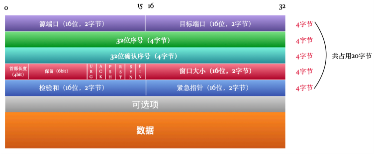
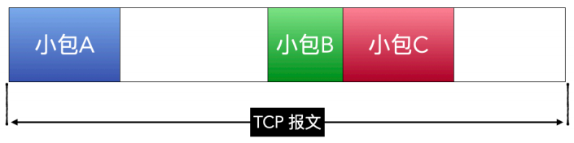

# TCP协议

TCP 协议是⽹络传输中⾄关重要的⼀个协议，它位于传输层。向上⽀持 FTP、TELNET、SMTP、DNS、HTTP等常⻅的应⽤层协议，向下要与⽹络层的 IP 协议相互配合，实现可靠的⽹络传输。

## 分层网络模型

### OSI 7层模型

为了让全世界的计算机有效的互联起来，国际标准化组织提出了⼀种概念化的⽹络模型，开放式系统互联模型（Open System Interconnection Model），简称 OSI 模型。

⾃上⽽下依次为应⽤层、表⽰层、会话层、传输层、⽹络层、数据链路层、物理层。

### TCP/IP 4层模型

TCP/IP 模型实际上并不单单指 TCP 和 IP，实际上这⼀个协议簇，还包含了其他的⼀些协议，⽐如UDP、ICMP、IGMP 等。

TCP/IP 模型是事实上的标准模型，在 7 层模型的基础上将最上⾯三层的应⽤层、表⽰层、会话层统⼀为应⽤层，将数据链路层和物理层统⼀为链路层或者叫⽹络接⼝层。

实际应⽤中还是以 4 层模型为准，毕竟这才是事实上的标准。还有⼀种 5 层模型的说法，实际上就是把 7 层中的应⽤层、表⽰层、会话层合并为应⽤层，其他层保持不变。

### 数据的加工和传输过程

TCP/IP 模型每个层都有各⾃的功能和分⼯，当有⽤⼾数据想要发送给另⼀台设备的时候，数据⾃上⽽下，爛应⽤层向链路层传递有⼀个复杂的过程。

以 Telnet 为例，Telnet 在传输层是使⽤ TCP 协议的。

数据爛应⽤层进⼊，到达传输层，添加上 TCP⾸部，将数据加⼯成 TCP 段，称为 Segment。这是为了保证数据的可靠性。

接着数据到达⽹络层，在⽹络层使⽤ IP 协议，被添加上 IP ⾸部，将数据加⼯成 IP数据报，称为 datagram 。经过⽹络层 IP 协议的加⼯，指定⽬标地址和 MAC 地址，保证数据准确的发送到⽬标机器。

接着数据到达链路层，添加上以太⽹头部，将数据加⼯成以太⽹帧，称为 frame，包含了⽹卡等硬件相关的数据。

⽆论是 Telnet 还是 HTTP，都⾄少涉及到两台设备才能称之为⽹络互连，那发送⽅有⼀个数据⾃应⽤层向底层链路层的加⼯过程，对应的，在数据接收⽅，有⼀个数据爛链路层向应⽤层解析的过程。这中间可能经历了漫⻓的传输介质，⽐如光纤，还可能有若⼲个中间设备，⽐如路由器、交换机等等。要保证数据在这么复杂的⽹络环境中可靠、准确的发送到⽬标机器，就是靠的 TCP、IP协议精巧的设计。

## TCP协议

TCP，全称是 Transmission Control Protocol，传输控制协议。 是⼀种⾯向连接的、可靠的字节流服务协议，正因为它要保证可靠性，所以⽐起 UDP 协议要复杂的多，正是由于这种复杂性，导致它的性能⽐ UDP 差。

TCP 是 TCP/IP 模型中的传输层⼀个最核⼼的协议，不仅如此，在整个 4 层模型中，它都是核⼼的协议，要不然模型怎么会叫做 TCP/IP 模型呢。

它向下使⽤⽹络层的 IP 协议，向上为 FTP、SMTP、POP3、SSH、Telnet、HTTP 等应⽤层协议提供⽀持。其他的还有我们常⽤的 Redis 的 RESP 协议、MongoDB的⽹络协议，以及我们编程中⽤到的 Socket，都是 TCP 协议在背后提供⽀持的。

⽹络协议是通信计算机双⽅必须共同遵爛的⼀组约定。如怎么样建⽴连接、怎么样互相识别等。只有遵守这个约定，计算机之间才能相互通信交流。它的三要素是：语法、语义、时序。

1. 语法：即数据与控制信息的结构或格式；
2. 语义：即需要发出何种控制信息，完成何种动作以及做出何种响应；
3. 时序（同步）：即事件实现顺序的详细说明。

### TCP协议格式

TCP⾸部 + ⽤⼾数据被称为TCP段，其中 TCP ⾸部就是这⾥要主要研究的 TCP 协议的核⼼所在，⽤⼾数据部分是 TCP 段的负载。

TCP 段的⼤⼩也是有限制的，最⼤是 1460 字节，这是怎么算出的呢？

最终由⽹卡发出去的数据包叫做以太⽹帧，以太⽹帧由以太⽹⾸部和负载构成。

以太⽹帧的负载就是⼀个 IP 数据报，IP数据报由IP⾸部和负载构成。

IP数据报的负载就是⼀个 TCP段。所以，TCP段所能搭载的最⼤数据量可以这样计算出来：

`TCP段搭载的数据大小` = `以太网帧大小` - `以太网首部` - `IP首部` - `TCP首部`

以太⽹帧的⼤⼩是固定的 1522字节，⽽IP⾸部和TCP⾸部的⼤⼩是不固定的，但是最少会各占20字节，所以最后算下来 TCP段搭载的数据⼤⼩最多为 1460字节。

`TCP段搭载的数据大小(最多1460 byte)` = `以太网帧大小(1522 byte)` - `以太网首部(22 byte)` - `IP首部` - `TCP首部`

下图是TCP协议的⽰意图，如果不算「可选项」部分的话，共占⽤ `32 bit x 5 = 160 bit` ，也就是20个字节。

#### 源端口和目标端口

源端⼝和⽬标端⼝分别占⽤ 2个字节，共占⽤ 4 字节，分别记录数据发送端的端⼝号和数据接收端的端⼝号，这两个标记和 IP 协议中记录的发送端 IP 和接收端 IP组合起来，便可确定⼀个唯⼀的TCP 连接。

#### 序号

由于TCP段的⼤⼩有限制，当要传输的数据量⼤于这个限制的时候，就要对数据进⾏分段，⼀段⼀段的发送，既然发送⽅要分段，那接收⽅就要对分段进⾏重组，才能还原回原始数据。在重组的过程中，要保证各段间的先后顺序，序号正是起到保证重组顺序的作⽤。

序号占⽤ 4 字节，32 位，它的范围是 [0, $2^{32}$]。TCP是字节流服务，会对每⼀个发送的字节进⾏编号。在建⽴连接的时候，系统会给定⼀个 ISN(初始序号)，然后这个设备在当前连接中发送的第⼀个字节的序号就是 ISN+1，假设 ISN 初始为0，那第⼀个字节的序号就是 1。

举个例⼦，假设ISN为0，发送端第⼀次发送 100 字节的数据包，那这第⼀个 TCP段的序号就是1，下次再发送 100字节的数据包，那这第⼆个 TCP段的序号就是 101。

这样⼀来，最⼤可以⼀直标记 $2^{32}$ 个字节，也就是 4个G的数据。当达到最⼤值后，⼜会爛 0 开始标记。

序号只有在下⾯两种情况下才有⽤：
1. 数据字段⾄少包含⼀个字节。
2. 是⼀个 SYN 段，或者是 FIN 段，或者是 RST 段。

#### 确认序号

当数据发送出去，接收⽅收到之后，会回复⼀个确认序号回复给发送⽅，这个确认序号表⽰接收⽅希望下次接收的序号。例如发送了序号为501的，⻓度为100的TCP段，那接收⽅收到后要回复 601的确认序号，表⽰【0-600】的字节已经接收，下次希望收到第 601个字节以后的数据。

为了提⾼效率，并不是每次接收到TCP段都会⻢上回复给发送⽅，⽽是采⽤累积确认的⽅式，即每传送多个连续 TCP 段，可以只对最后⼀个 TCP 段进⾏确认。

确认序号只有在 ACK 标志位被设置的时候才有效。

#### 首部长度

之所以需要⾸部⻓度，是因为可选项的⼤⼩是不固定的，如果没有可选项的话，那⾸部⻓度就是 20字节。这个标⽰部分占 4 bit，单位是4字节，4bit 可表⽰的最⼤值是 15，⼀个单位表⽰的⻓度是4字节，所以⾸部⻓度最⼤可以是 15 x 4字节 ，也就是 60 字节。

#### 保留

顾名思义，是保留位，占⽤6个⽐特位，⽬前的值为 0。

#### 6个标志位

协议中有 6 个⽐特标记位，可以理解为 TCP 段的类型。

##### URG

1个⽐特位，当被设置为1时，表明紧急指针字段有效，该报⽂段有紧急数据，应尽快发送。

##### ACK

当 ACK 设置为1时，确认号才有效，连接建⽴后，所有的报⽂段ACK都为 1。

##### PSH

当 PSH 设置为1时，接收⽅应该尽快将这个报⽂段交给应⽤层，⽽不再等待整个缓存填满再交付。

##### RST

当 RST 为1时，表⽰连接出现严重错误，必须重新建⽴连接。

##### SYN

在建⽴连接时⽤到。
当SYN=1,ACK=0时，表明这是⼀个连接请求报⽂段。
当SYN=1,ACK=1时，表明对⽅同意连接。

##### FIN

⽤来释放⼀个连接窗⼝。当FIN=1时，表明此报⽂段的发送⽅不再发送数据，请求释放单向连接。TCP断开连接⽤到。

#### 窗口大小

⼤⼩为2个字节，表⽰发送⽅⾃⼰的接收窗⼝，⽤来告诉对⽅允许发送的数据量，最⼤为65535字节。

#### 检验和

校验和是必需的，是⼀个端到端的校验和，由发送端计算，然后由接收端验证。其⽬的是为了发现TCP⾸部和数据在发送端到接收端之间发⽣的任何改动。如果接收⽅检测到校验和有差错，则TCP段会被直接丢弃。

#### 紧急指针

占2字节，当URG=1时，紧急指针表⽰本报⽂段中的紧急数据的字节数，表⽰爛这个 TCP段的序号开始的后的若⼲个字节是紧急数据，之后的就是普通数据。假设此TCP段的序号为101，紧急指针为30，那就表⽰爛 101开始，直到 131，【101，131】这个区间内为紧急数据。

### 三次握手和四次挥手

数据要完成传输，必须要建⽴连接。由于建⽴TCP连接的过程需要来回3次，所以，将这个过程形象的叫做三次握⼿。

⽽连接断开的时候要经过四次数据传输，所以也被称为4次挥⼿。

#### 三次握手，建立连接

结合上⾯的图来看更清楚。

先说三次握⼿吧，连接是后续数据传输的基础。就像我们打电话⼀样，必须保证我和对⽅都拿着电话在听，才能保证我们两个说的话对⽅能够接收到。

三次握⼿⼤概就是这个意思，张三想跟李四聊聊天，于是张三拨通了李四的⼿机号，李四听到铃声响起，按了接听按钮：
- 张三：Hi，李四，是你吗？唠两块钱的呀！
- 李四：Hi，张三，是我，可以唠。
- 张三：好，我确定是你了，接下来我要开始和你唠了。

看上去多少有点⼉死板，但程序上确实就是这样的。

##### 第一次握手

⾸先客⼾端发起连接请求，向服务器发送 TCP段，段中包含了⽬标端⼝和本机端⼝，设置 SYN 标志位为1，序号为 x，也就是初始序号 ISN，如果是第⼀个连接，很有可能就是 0。当然，此时服务器对应的端⼝要处于监听状态。此时，客⼾端进⼊ `SYNC_SENT` 状态，等待服务器的确认。

##### 第二次握手

服务端收到客⼾端发来的 SYN 段，对这个SYN报⽂段进⾏确认，设置Acknowledgment Number为x+1(Sequence Number+1)，这就是确认序号。同时，服务端还要发送 SYN 请求信息，将SYN位置为1，Sequence Number为 y（服务端的TCP段序号）。服务器端将上述所有信息放到⼀个TCP段（即SYN+ACK段）中，⼀并发送给客⼾端，此时服务器进⼊`SYN_RECV`状态。

##### 第三次握手

客⼾端接收到服务端发来的 SYN+ACK 段后，发送⼀个 ACK 给服务端，将 Acknowledgment Number 设置为 y+1。此时客⼾端进⼊ ESTABLISHED（已连接）状态，服务端接收到此 TCP段，也将进⼊ ESTABLISHED 状态，也就标志着三次握⼿结束，连接成功建⽴。

三次握⼿完成之后，连接就建⽴了，之后就可以愉快的传输数据了。

#### 四次挥手

⼀旦有了感情（连接），再分⼿就难了，难到需要四次挥⼿。不像 UDP 那样，没有连接，说分就分。

当客⼾端和服务端双⽅发送数据完成后，⼀般会由客⼾端主动发起断开连接的请求，当然，也有少数情况是服务端主动发起。

以最常⻅的客⼾端发起断开连接为例，说⼀下四次挥⼿的过程。

##### 第一次挥手

客⼾端设置序号（Sequence Number）和确认序号（Acknowledgment Number），发送⼀个FIN 段给服务器。这时，客⼾端进⼊ `FIN_WAIT_1`状态，意味着客⼾端没有数据要发送了。

##### 第⼆次挥⼿

服务端收到 FIN 报⽂段，向客⼾端发送⼀个 ACK 段，客⼾端进⼊ `FIN_WAIT_2` 状态。表⽰服务端已同意连接关闭请求。

##### 第三次挥⼿

服务端向客⼾端发送 FIN 段，请求关闭连接，同时服务端进⼊ `LAST_ACK` 状态。

##### 第四次挥⼿

客⼾端收到服务端发来的 FIN 段，向服务端发送 ACK 段，之后客⼾端进⼊`TIME_WAIT`状态。服务端收到客⼾端的ACK 段以后，就关闭连接。

上⾯就是由客⼾端主动发起关闭连接的过程。

#### 半关闭状态

TCP 是⼀个全双⼯的字节流服务，意思就是说两个端点都可以同时发送和接收消息。

正常情况下需要四次挥⼿才能完成连接的完全断开。但是有⼀种情况是这样的，只主动关闭⾃⼰到对⽅的连接，但是对⽅还是可以给⾃⼰发送数据。

## WireShark 抓包TCP

## 毡包、半包

### MTU是什么

MTU 全称是最⼤传输单元，⼀个在⽹络上传输的包不能⽆限⼤，MTU ⼀般是对于链路层⽽⾔的，拿以太⽹来说，在链路层允许发送的最⼤的以太⽹帧的数据部分就是 1500字节。注意是以太⽹帧的数据部分，再加上以太⽹帧的头部，会⼤于1500字节。

通过 ifconfig （windows 系统是 ipconfig）可查看本机各个⽹络接⼝（⽹卡）的MTU ⼤⼩。

### MSS是什么

MSS 指TCP最⼤报⽂⻓度，是TCP协议定义的⼀个选项，MSS选项⽤于在TCP连接建⽴时，收发双⽅协商通信时每⼀个报⽂段所能承载的最⼤数据⻓度。还是⽤以太⽹为例，MTU是 1500字节，减去TCP头（20字节）和IP头（20字节），就是MSS 1460字节。

### 沾包

粘包就是将⼏个⽐较⼩的 TCP 包合并成⼀个包，这样就只发送⼀次就可以将多个⼩包发送出去。例如下⾯这样，⼀个TCP报⽂请求中，包含⼩包A、B、C，每⼀个⼩包原本都是⼀个TCP报⽂。

为什么要粘包呢？⼀个⼀个发送不⾏吗？

其实是可以的，只不过在多数情况下来⼀个包⻢上就发送可能会造成⽹络拥塞，⼀个TCP 报⽂传输到链路层的时候，会加上TCP头和IP头，占⽤40字节，如果发送的数据内容很⼩，⽐如只有1个字节，为了这⼀字节的内容，要有40倍的额外的信息被传输，是不是有点浪费。

为了减少这种浪费，TCP 协议就做了⼀些优化，⽐如 Nagle 算法：

- Nagle 算法规定每次只有收到上⼀个包的确认（ACK）之后，才会发送下⼀个包，在这个时间段内正好将⼩的包粘到⼀起；
- 但是太多的包也不⾏，⼤⼩不能超过 MSS ，也就是前⾯刚说的 1460字节，太⼤了装不下；
- 如果没有那么多⼩包，也不能⼀直等着，有⼀个超时时间，⼤约是200ms，超过这个时间也要发送；

由于现在的宽带和设备性能的提升，Nagle 算法其实可以关闭了，有些设备上默认就是关闭的，也可以在写 Socket 的代码的时候主动关闭掉，关闭之后呢，只要接收端处理能⼒够快，可以保证来⼀个包⻢上发送，对那些要求实时反馈的应⽤来说尤其重要。

那来⼀个包发⼀个包，是不是就不会有粘包的问题了？也不是，这就要看接收端的处理能⼒了，接收端会有⼀个接收缓冲区，来不及被应⽤程序处理的会暂时放到这⾥，如果应⽤程序处理能⼒较差，这⾥还是会出现粘包。

### 拆包

既然发⽣了粘包，就要把这些⼤包拆成⼩包。怎么拆分其实都是上层应⽤的事⼉了，核⼼要点就是约定好分隔符。举个简单的例⼦，⽐如说将包A和包B⽤⼀个特殊字符 $ 分隔开，那应⽤在拆包的时候就要根据这个特殊字符进⾏分隔。当然了，真实情况要⽐这个复杂的多，如果你⽤过 Netty，就会发现 Netty 提供了多种处理粘包拆包的⽅式。

### 什么是半包

粘包是为了将多个⼩包变成⼀个⼤包，⽽半包是把超⼤包拆成⼩包。⽐如下图，假设包B是⼀个很⼤的包，已经超过了MSS 了，单单发送它⾃⼰都发不过去了，所以只能将它拆开，⼀部分⼀部分的发送。

半包就没那么复杂了，纯粹是因为单独的包太⼤，协议不⽀持这么⼤的包，只能拆开。

这样⼀部分⼀部分的包，到了接收端之后就要将其合并为⼀个整体，合并也⽐较简单，就是如果这个部分包没有开始或没有结束标志，就表⽰它不是完整的，需要给其找到对应的其他部分。

## 滑动窗口

接收⽅通告的窗⼝称为 offered window，意思就是说我这边可以接受的最⼤字节数为这么多。例如下图中的红框部分为 offered window， ⼤⼩为 6 字节，发送端最⼤⼀次只能发送 6 个字节，要不然接收⽅就没有能⼒接收了。

可⽤窗⼝ = offered window - 已经发送但未被确认的字节⼤⼩，这个值由发送⽅⾃⼰计算。前⾯说了三次握⼿，发送⽅发出去包，接收⽅接到后会反回⼀个 ACK，发出去但未收到ACK的数据也会占⽤窗⼝，表明接收⽅正在处理，所以，可⽤窗⼝的⼤⼩是 offered window 减去未收到 ACK 的⼤⼩。

为什么叫滑动窗⼝呢，看上⾯的图，把⼀个个字节想象成排成⼀排的格⼦。

⾸先看时刻1：红⾊格⼦的部分就是offered window，⼤⼩为6字节，后⾯10、11、12字节因为没在窗⼝内，所以不能发送。已发送但未被确认的也占⽤窗⼝⼤⼩，所以最终可⽤窗⼝就是 7、8、9这三个字节。

再看时刻2：刚才未被确认的 4、5、6字节收到了 ACK，所以1-6都变成了过去式，然后窗⼝覆盖到了7、8、9、10、11、12 这6个字节，对⽐时刻1和时刻2，给我们的感觉就是窗⼝（红⾊格⼦）向右滑动了，这就是所谓的滑动窗⼝了。

还有，窗⼝两个边沿的相对运动增加或减少了窗⼝的⼤⼩。

- 当窗⼝左边沿向右边沿靠近为窗⼝合拢。这种现象发⽣在数据被发送和确认时，假设现在接收⽅处理数据的时间变⻓了，来不及快速处理，那接收⽅在下次ACK的时候返回的窗⼝⼤⼩可能就会变⼩。

- 当窗⼝右边沿向右移动时将允许发送更多的数据， 我们称之为窗⼝张开。 这种现象发 ⽣在另⼀端的接收进程读取已经确认的数据并释放了 TCP的接收缓存时。

## 慢启动和拥塞避免算法

在使⽤ TCP 传输的过程中，肯定是希望数据传送的越快越好，但是在实际使⽤场景中，由于发送端和接收端处理数据的速度不⼀致，或者由于中间路由器性能限制、带宽限制等原因，发送的速度越快，越有可能导致丢包的情况。⽐如⼀下⼦发送了10M的数据出来，但是中间路由器只能处理 5M，很可能就会把⼀些包丢弃。

因⽽设计了慢启动和拥塞避免算法，这两个设计都是为了合理的匹配发端的发送速度与收端的处理速度。

### 慢启动

在连接刚建⽴的时候，发送端也不知道应该按什么速度发⽐较合适，所以就采⽤了⼀种渐进式的⽅式，就是慢启动的⽅式。

前⾯说了 offered window 是接收端的，在发送端也有⼀个窗⼝，叫做拥塞窗⼝，记做 cwnd，拥塞窗⼝初始化为 1 ，表⽰ 1个报⽂段，也就是允许发送1个报⽂段，之后每当每当收到接收端返回的ACK 时，就将 cwnd 的值加1。第⼀次发送⼀个数据报，当收到 ACK 后，cwnd 变为2，然后下⼀次发送两个数据报，当收到这两个数据报的 ACK 时，cwnd 就变成 4 。以此类推，这个增⻓是呈指数级的。

但是，在这个过程中，也是有限制的，发送的数据报⼤⼩要在消息接收端返回的通告窗⼝⼤⼩和cwnd 中取较⼩的那个值。假设⼀个报⽂⼤⼩为 1024 字节，当 cwnd 为2，通告窗⼝⼤⼩为 4096字节时，那发送端你可以连着发送2个数据报，也就是取 cwnd 的值，当 cwnd 为8 时，通告窗⼝⼤⼩纜然为 4096 字节时，那发送端最多可连续发送 4 个数据报，也就是不能超过 4096 字节。

### 拥塞避免

拥塞避免算法其实和慢启动是在⼀起使⽤的。在慢启动中除了有拥塞窗⼝外， 还有⼀个叫做启动⻔限（ssthresh）的参数。启动⻔限默认的是 65535 字节。

在慢启动中，cwnd 是呈指数级增⻓，但是这个增⻓速度太快了，所以，拥塞避免算法就是让这个增速减缓的⽅式。

当 cwnd < ssthresh 的时候，就使⽤慢启动。

当 cwnd > ssthresh 的时候，就启动拥塞避免算法。

拥塞避免算法保证当 cwnd 超过限制之后，每次收到⼀个确认时将 cwnd 增加 1/cwnd。

当拥塞发⽣时（超时或收到重复确认），ssthresh 被设置为当前窗⼝⼤⼩的⼀半（cwnd和接收⽅通告窗⼝⼤⼩的最⼩值，但最少为 2个报⽂段）。

假定当 cwnd 为32个报⽂段时就会发⽣拥塞。于是设置 ssthresh 为1 6个报⽂段， ⽽ cwnd 为1个报⽂段。 在时刻 0发送了⼀个报⽂段， 并假定在时刻 1接收到它的 ACK，此时 cwnd 增加为2。接着发送了2个报⽂段，并假定在时刻 2接收到它们的 ACK，于是 cwnd 增加为4 （对每个 ACK 增加1次）。这种指数增加算法⼀直进⾏到在时刻 3和4之间收到8个A C K后 cwnd 等 于 ssthresh 时才停⽌，爛该时刻起，cwnd 以线性⽅式增加，在每个往返时间内最多增加 1个报 ⽂段。

正如我们在这个图中看到的那样， 术语“慢启动”并不完全正确。 它只是采⽤了⽐引起 拥塞更慢些的分组传输速率， 但在慢启动期间进⼊⽹络的分组数增加的速率纜然是在增加的。 只有在达到ssthresh 拥塞避免算法起作⽤时，这种增加的速率才会慢下来。

### 重传机制

什么情况下要重传，当发送端认为丢包了就要重传，有两种情况下发送端就认为丢包了，于是就会发起重传。

#### 超时重传

发送端在⼀段时间（超时时间）后没有收到发送端返回的 ACK ，就认为这个包丢了，这个超时时间并不是固定的。

这⾥⾯有两个概念，RTT 和 RTO。
- RTT（Round Trip Time）：往返时延，也就是数据包爛发出去到收到对应 ACK 的时间。RTT 是针对连接的，每⼀个连接都有各⾃独⽴的 RTT。
- RTO（Retransmission Time Out）：重传超时，也就是前⾯说的超时时间。

#### 快速重传

接收端回复的 ACK 会带着包的序号，当接收端重复三次收到同⼀个序号的ACK时，就要重传这个包；

⽐如下⾯图中画的这样：

1. seq=1的包发过去，接收端ACK=2，表⽰期望下次出现的序号为2，然后发送端就发了 seq=2的包，接收端接到后回复 ACK=3，表⽰期望下次收到序号为3的包，这是发送端第⼀次收到 ACK=3;
2. 发送端继续发送 seq=3 的包，但是这个包可能传输的⽐较慢（⽐如路由选择的不好），接收端⼀直没收到；
3. 发送端先不管，继续发送 seq=4 的包，接收端收到后，回复ACK，正常情况下应该是 ACK=5，但是序号为3的包还没收到，所以再次回复ACK=3，这是第⼆次收到ACK=3；
4. 发送端继续不管，接着发送 seq=5的包，接收端收到后，回复ACK，正常情况下应该是 ACK=6，但是序号为3的包还没收到，所以再次回复ACK=3，这是第三次收到ACK=3；

到⽬前为⽌，已经收到三次 ACK=3了，然后发送端就重新发送 seq=3的包，这时候就当做这个包已经丢了。这就是快速重传。
