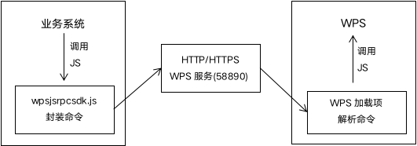

# JSAPI二次开发文档概述及原理

## JSAPI概述

JSAPI技术一般也叫做WPS加载项技术，在WPS中开发的功能插件叫做WPS加载项。WPS 加载项是一套基于 Web 技术用来扩展 WPS 应用程序的解决方案。每个 WPS 加载项都对应打开了一个网页，并通过调用网页中 JavaScript 方法来完成其功能逻辑。这些页面可直接与WPS进行交互。WPS 加载项的底层是以 Chromium 为基础进行的扩展，也因此JSAPI具有跨平台的特性。

## JSAPI的能力

### JSAPI的应用范围
- 以单个完整插件 的形式出现：完整的插件功能。实现WPS的功能扩展如: PS插件等
- 以 集成 的形式出现：标准化集成。与业务系统进行功能性对接如：OA助手等

### JSAPI的定制能力
- 自定义功能区
- 任务窗格
- web对话框

### JSAPI的开发优势

## JSAPI对比传统集成方式的创新

### 3.1.JSAPI的产生原因
JSAPI主打跨平台跨浏览器。JSAPI主要是为了丰富WPS的定制能力与开发能力，优化业务系统的集成能力和跨平台能力而产生的。传统的加载项存在XC操作系统不能使用的问题，为了克服不同系统平滑过渡的困难，我们选择了使用Windows与Linux都支持的JS语言进行支持在XC下的宏是JS宏，XC下的加载项的技术则是JSAPI。

## JSAPI在集成方面的技术原理

通常我们想要实现业务系统集成一个功能，需要分为两步，功能开发(加载项开发)和集成开发
- 功能开发：WPS中的功能定制，如：套红，插入二维码，插入签名，书签填充等
- 集成开发：业务系统调用以上功能，实现在用户与业务系统交互，WPS触发上述功能的效果。

### 加载项开发

JSAPI可以直接触发WPS的动作，用JSAPI开发的功能插件叫做WPS加载项。

### JSAPI与业务系统集成原理

现在通过wps.alert()已经可以实现弹出个框，那么如果我想通过网页上的一个按钮来调用WPS弹出框该如何实现呢？
这里提到3个概念：
- WPS服务：该服务为外部与WPS的通讯工具，是通过HTTP协议进行传输的，调用WPS自定义功能的接口。我们可以通过访问http://127.0.0.1:58890/version检测该服务是否正常
- 浏览器自定义协议：浏览器自定义协议是以URL的形式唤起电脑应用的一种方式
- SDK - wpsjsrpcsdk.js：wpsjsrpcsdk.js是JSAPI提供给业务系统调用加载项的一个SDK 在集成方面，传统的集成方式是以浏览器嵌入式控件为主，我们可以用已封装好的SDK去调用，但是在JSAPI中，我们提倡大家自行定义WPS的能力。所以请务必了解，这里的SDK不是传统的SDK概念。这里的SDK是JSAPI提供业务系统，进行调用加载项的的一个接口。我们通过加载项开发自定义了一个动作。接下来SDK把这个动作封装好传递给WPS，这个动作包含函数名称和参数，WPS收到后再根据这个动作进行相对应的操作。


> 例：如业务系统让WPS进行套红操作的步骤则是<br/>
> 业务系统 -> 封装套红请求 -> WPS服务 -> WPS -> 解析封装的命令 -> 套红动作 <br/>
> 开发者在完成加载项开发后，只需要通过调用SDK便可以实现业务系统与加载项的连通。<br/>
> PS: 该SDK是双向调用，也支持WPS主动传递消息至业务系统。

## WPS加载项体验

使用 git 下载 demo

```shell
git clone https://code.aliyun.com/zouyingfeng/wps.git
```

## 更多文档

|||
|---|---|
|WPS开放平台|[https://open.wps.cn/docs/office](https://open.wps.cn/docs/office)|
|JSAPI概述及原理|[https://kdocs.cn/l/skWT29577eEE](https://kdocs.cn/l/skWT29577eEE)|
|JSAPI集成开发文档|[https://kdocs.cn/l/srARJ5L8CTx4](https://kdocs.cn/l/srARJ5L8CTx4)|
