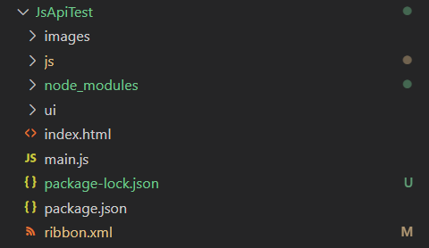

# JSAPI二次开发文档——应用集成开发

## JSAPI 快速上手

### 环境准备
#### 开发环境准备
- node.js
- npm
- vim

#### wpsjs 安装

WPSJS：是金山办公提供开发者开发的npm工具包，主要用于WPS加载项的创建，打包，publish模式发布

```
npm install -g wpsjs
```

#### 代码补全工具安装

```
npm install -g --save-dev wps-jsapi
```

### 创建第一个加载项 

#### 创建工程

```
wpsjs create [工程名]
```

#### 加载项工程结构介绍

1. 目录结构

```
+[images] ————————图片资源 ribbon 菜单中的图标等
+[js]
dialog.js ————————对话框功能 JS
ribbon.js ————————ribbon 入口功能 JS
systemdemo.js——————业务系统接口定义
taskpane.js ————————任务窗格JS
util.js ————————工具类 包括枚举定义等
+[node_modules]
+[wps-jsapi] ————————代码提示工具
+[ui]
dialog.html ————————定义对话框内部页面
taskpane.html ——————定义侧边栏内部页面
index.html ————————入口文件
main.js——————————用来加载各JS
package.json
package-lock.json
ribbon.xml  ————————定义customUI
```

其中index.html和ribbon.xml为核心文件
index.html代表项目加载的入口，在业务系统唤醒WPS时，首先加载的就是该文件
ribbon.xml代表定义的功能，如按钮、右键菜单、事件重写等。并对其这些事件定义了visible/enable/action的入口
2. index.html说明
index入口文件：在index中我们只加载了main.js一个文件。事实上我们可以更具业务系统的需求自行修改

3. main.js说明。该文件主要用来加载所有代码

在main.js中加载代码时在末尾添加时间参数，用户每次打开客户端可获取到最新代码，免去清除缓存步骤（如下例图）

4. ribbon.xml说明

|名词|解释|
|----|----|
|Tab|工具栏|
|Group|组|
|Button|按钮|
|Label|显示名称|
|GetLabel|设置名称的事件|
|OnAction|按钮点击事件/命令执行事件|
|Enabled|启用状态|
|GetEnabled|设置启用状态的事件|
|Visible|可视状态|
|GetVisible|设置可视状态的事件|
|GetImage|设置图标的事件|
|Size|按钮大小|
|Command|命令|
|IdMso|命令的idMso(不等于id)|
|ContextMenu|右键菜单|
|OnLoad|初始化事件|

GetLabel、GetEnabled、GetVisible、GetImage这些属性的值应该填写一个函数名在加载到该按钮的时候，会根据这些函数去动态返回一个按钮的属性。例如：


### 部署加载项插件的两种模式

开发完成后，插件如何被客户端加载？如何进行加载项的部署与安装？
集成插件一般分为两种模式部署模式，Publish 与 动态传递模式(又称JsPlugin模式)，这两种方式都需要把加载项代码部署在服务器上。
- 动态传递模式：适用于多个业务系统同时集成WPS
- Publish模式：适用于离线插件扩展，及单业务系统集成

#### 安装和加载原理

Publish 与 动态传递模式，都是通过动态加载服务器上的代码来进行加载插件的。WPS加载插件：


动态传递模式：
动态传递无安装过程，需要在业务系统调用sdk时传入jsplugin.xml地址。

#### 部署加载项代码

##### Publish模式
适用作为功能拓展为主的插件 及 业务系统集成使用Publish 模式，wps启动时都会加载该插件
部署步骤：
1.使用wpsjs包的wpsjs build命令进行打包
2.使用wpsjs包的wpsjs publish命令进行发布
3.将目录wps-addon-build下的文件署到服务器 (加载项代码)
4.将wps-addon-publish下的publish.html文件部署到服务器上 (publish.html加载项安装页面)
5.告知用户publish.html地址进行安装。

##### 动态传递模式
动态传递模式，业务系统调用才会加载加载项，需唤醒时传入加载项地址
部署步骤：
1.使用wpsjs包的wpsjs build命令进行打包
2.配置jsplugin.xml文件, url属性为加载项地址。此步参考demo中server/wwwroot/jsplugin.xml 文件
3.将目录wps-addon-build下的文件署到服务器 (加载项代码)
4.将jsplugin.xml文件部署到服务器上 (WPS访问jsplugin.xml的配置加载对应代码)
5.业务系统集成时，调用唤起WpsInvoke传入jsplugin.xml地址

#### 代码调试

在 WPS 的我的加载项中可以看到 JS 调试器

调试器的开启与使用：
1.配置oem.ini文件, 在support栏下配置 JsApiShowWebDebugger=true
oem.ini文件路径
[windows] 安装路径\WPS Office\{版本号}\office6\cfgs
[linux] /opt/kingsoft/wps-office/office6/cfgs/
[uos] /opt/apps/cn.wps.wps-office-pro/files/kingsoft/wps-office/office6/cfgs/
2. linux机器上需要使用quickstartoffice restart重启WPS
3. WPS打开后，在有文档的情况下按alt+F12 (index.html页面的调试器)
4. ShowDialog和Taskpane页面的调试器，点击该弹窗或者任务窗格，按F12

如果无法打开调试器，说明加载项加载失败
如果是Publish模式，排查jsaddon文件夹中
加载项管理文件是否生成
加载项管理文件中的加载项地址是否正确
加载项管理文件中的加载项地址是否能正常访问

> 注：动态传递模式，需要以业务系统唤醒的方式打开wps才有调试功能

### 业务系统集成加载项

集成SDK：wpsjsrpcsdk.js，用于wpsjs加载项，web前端页面的编写

目前支持：
- 单进程模式：用户窗口下仅启动一个wps客户端，所有操作都会反映到该wps客户端下
- 多进程模式：用户窗口下可以启动多个wps客户端，通过使用WpsClient对象调用接口，可以将操作发送到对应的wps客户端上，不同wps客户端互不影响
- 常用接口使用
```
## 管理wps加载项：
WpsAddonMgr.enable
> 启用加载项
> @param {*} element   参数对象
> @param {*} callBack  回调函数

WpsAddonMgr.disable
> 禁用加载项
> @param {*} element   参数对象
> @param {*} callBack  回调函数

WpsAddonMgr.getAllConfig
> 获取publish.xml的内容
> @param {*} callBack 回调函数

WpsAddonMgr.verifyStatus
> 检查ribbon.xml文件是否有效
> @param {*} element   参数对象
> @param {*} callBack  回调函数

## 单进程模式：
WpsInvoke.InvokeAsHttp
> 以http协议启动wps
> @param {*} clientType			加载项类型， wps / wpp / et
> @param {*} name			加载项名称
> @param {*} func				客户端加载项要执行的方法
> @param {*} param			客户端加载项执行方法的参数
> @param {*} callback			回调函数
> @param {*} showToFront		设置客户端是否显示到前面
> @param {*} jsPluginsXml		设置加载项路径
> @param {*} silentMode		是否是静默启动

WpsInvoke.InvokeAsHttps
> 以https协议启动wps
> @param {*} clientType			加载项类型， wps / wpp / et
> @param {*} name			加载项名称
> @param {*} func				客户端加载项要执行的方法
> @param {*} param			客户端加载项执行方法的参数
> @param {*} callback			回调函数
> @param {*} showToFront		设置客户端是否显示到前面
> @param {*} jsPluginsXml		设置加载项路径
> @param {*} silentMode		是否是静默启动

WpsInvoke.RegWebNotify
> 注册一个前端页面接收WPS传来消息的方法
> @param {*} clientType wps | et | wpp
> @param {*} name WPS加载项的名称
> @param {*} callback 回调函数

WpsInvoke.IsClientRunning
> 当前客户端是否在运行，使用WpsInvoke.IsClientRunning()进行调用
> @param {string} clientType       加载项类型
> @param {function} [callback]     回调函数，返回值如下：
> "Client is running." 客户端正在运行
> "Client is not running." 客户端没有运行

WpsInvoke.ClientType
> 加载项类型
> wps /et/wpp

## 多进程模式：
var wpsClient = new WpsClient(WpsInvoke.ClientType.wps)
> @constructor WpsClient				wps客户端
> @param {string} clientType				必传参数，加载项类型，有效值为"wps","wpp","et"；分别表示文字，演示，电子表格

wpsClient.InvokeAsHttp
> 以http启动
> @param {string} name					加载项名称
> @param {string} func					要调用的加载项中的函数行
> @param {string} param				在加载项中执行函数func要传递的数据
> @param {function({int, string})} callback	回调函数，status == 0 表示成功，失败请查看message信息
> @param {bool} showToFront			设置wps是否显示到前面来
> @return {string}						返回值：
> "Failed to send message to WPS."		发送消息失败；
> "WPS Addon is not response."			加载项阻塞，函数执行失败

wpsClient.InvokeAsHttps
> 以https启动
> @param {string} name					加载项名称
> @param {string} func					要调用的加载项中的函数行
> @param {string} param				在加载项中执行函数func要传递的数据
> @param {function({int, string})} callback	回调函数，status == 0 表示成功，失败请查看message信息
> @param {bool} showToFront			设置wps是否显示到前面来

wpsClient.onMessage
> 消息注册函数的回调函数

wpsClient.StartWpsInSilentMode
> 以静默模式启动客户端
> @param {string} name                 必传参数，加载项名称
> @param {function({int, string})} [callback]         回调函数，status == 0 表示成功，失败请查看message信息

wpsClient.ShowToFront
> 显示客户端到最前面
> @param {string} name             必传参数，加载项名称
> @param {function({int, string})} [callback]     回调函数

wpsClient.jsPluginsXml
> 设置加载项路径
```

## 常用功能开发
https://www.kdocs.cn/l/cmQgqoUHBUiL
https://p.wpseco.cn/wiki/doc/63338888d7c60f8bf1fd8700
